# FINT Kafka Library

[](https://github.com/FINTLabs/fint-kafka/actions/workflows/ci.yaml)

Et Spring Boot-bibliotek for Kafka som gir:

- type-safe producer/consumer-oppsett
- streng og konsistent topic-navngivning
- robust feilhåndtering for record- og batch-listenere
- støtte for request/reply over Kafka
- tjenestelag for oppretting og oppdatering av topics

README-en er skrevet for:

- nybegynnere som trenger begreper forklart
- erfarne Kafka-brukere som vil forstå detaljer i polling, offsets, retry/recovery og runtime-oppførsel

## Innhold

1. [Kom i gang](#kom-i-gang)
2. [Arkitektur](#arkitektur)
3. [Builder vs stepBuilder](#builder-vs-stepbuilder)
4. [Topic-navngivning](#topic-navngivning)
5. [Producere](#producere)
6. [Consumere](#consumere)
7. [Record-listener vs Batch-listener](#record-listener-vs-batch-listener)
8. [Feilhåndtering i dybden](#feilh%C3%A5ndtering-i-dybden)
9. [Scenario: batch med 56 meldinger og feil midt i batch](#scenario-batch-med-56-meldinger-og-feil-midt-i-batch)
10. [Kafka-teori: polling, timeouts og offsets](#kafka-teori-polling-timeouts-og-offsets)
11. [Request/Reply](#requestreply)
12. [Topic-oppretting og cleanup policies](#topic-oppretting-og-cleanup-policies)
13. [Best practices](#best-practices)
14. [Feilsøking](#feilsøking)
15. [API-hurtigreferanse](#api-hurtigreferanse)

## Kom i gang

### Avhengighet

Biblioteket publiseres som `no.novari:kafka` (artifact-navn fra prosjektet er `kafka`).

Gradle:

```kotlin
dependencies {
    implementation("no.novari:kafka:<version>")
}
```

### Minimal konfigurasjon

`KafkaConfiguration` auto-konfigureres via Spring Boot (`AutoConfiguration.imports`).

Minstekrav i `application.yml`:

```yaml
spring:
  kafka:
    bootstrap-servers: localhost:9092
    consumer:
      group-id: my-consumer-group

novari:
  kafka:
    application-id: my-app
    default-replicas: 2
    topic:
      org-id: my-org
      domain-context: my-domain

fint:
  kafka:
    enable-ssl: false
```

Viktige nøkler:

- `novari.kafka.application-id` brukes i producer-header `origin.application.id`
- `novari.kafka.default-replicas` brukes ved topic-oppretting
- `novari.kafka.topic.org-id` + `novari.kafka.topic.domain-context` er defaults i topic-navn
- `fint.kafka.enable-ssl=true` aktiverer SSL-props basert på `spring.kafka.ssl.*`
- consumer default `auto.offset.reset` settes til `earliest` i bibliotekets `ConsumerConfig`-bean

## Arkitektur

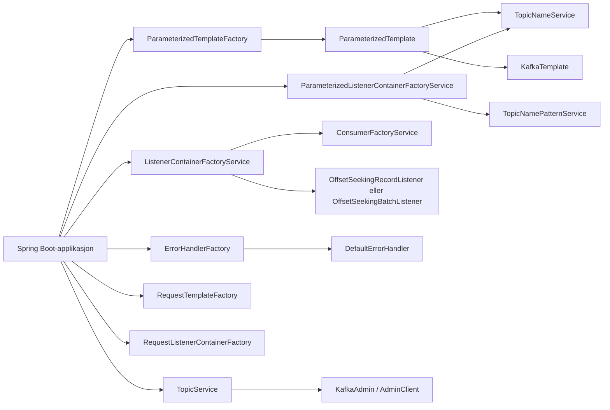

## Builder vs stepBuilder

Biblioteket bruker begge mønstre:

- `stepBuilder`: guider deg gjennom lovlig rekkefølge av valg (foretrukket i de fleste tilfeller)
- `builder`: rask og fleksibel konstruksjon når du allerede har alle felter

### Hvorfor stepBuilder er foretrukket

- du blir tvunget gjennom viktige beslutninger (f.eks. retry-klassifisering, recovery-strategi)
- vanskeligere å lage delvis ugyldig konfigurasjon
- bedre lesbarhet i kodegjennomgang

### Hva bruker hva

| Kategori | Klasser | Kommentar |
|---|---|---|
| Kun `stepBuilder` | `TopicNamePrefixParameters`, `TopicNamePatternPrefixParameters`, `EventTopicConfiguration`, `EntityTopicConfiguration` | Designet for trygg, sekvensiell oppbygging |
| Både `builder` og `stepBuilder` | `ListenerConfiguration`, `ErrorHandlerConfiguration`, `RequestListenerConfiguration` | `stepBuilder` anbefales for normal bruk |
| Kun `builder` | `ParameterizedProducerRecord`, `RequestProducerRecord`, `ReplyProducerRecord`, `TopicConfiguration`, `RequestTopicConfiguration`, `ReplyTopicConfiguration`, samt de fleste `*TopicNameParameters` | Egnet som dataobjekter |

Beskrivelse av "noen har bare `builder`, mange har bare `stepBuilder`, og noen har begge":

- i dette biblioteket er det flest sentrale konfig-objekter som bruker `stepBuilder`
- rene payload-/parameter-objekter bruker som regel bare `builder`
- tre sentrale konfig-objekter støtter begge

## Topic-navngivning

### Standard format

Alle topics bygges rundt dette mønsteret:

`<orgId>.<domainContext>.<messageType>.<suffix...>`

Eksempler:

- `my-org.my-domain.event.student-created`
- `my-org.my-domain.entity.student`
- `my-org.my-domain.request.student.by.fnr`
- `my-org.my-domain.reply.my-app.student`
- `my-org.my-domain.event.error.student-sync-failed`

### MessageType

- `EVENT` -> `event`
- `ENTITY` -> `entity`
- `REQUEST` -> `request`
- `REPLY` -> `reply`

### Validering

Biblioteket validerer topic-komponenter:

- obligatoriske felt må være satt
- `orgId` og `domainContext` kan ikke være blanke
- komponenter kan ikke inneholde `.`
- komponenter kan ikke inneholde store bokstaver

Merk: andre tegn er i praksis tillatt av valideringen så lenge de ikke bryter reglene over.

### Defaults for prefix

Hvis du ikke setter `orgId`/`domainContext` eksplisitt i prefix, erstattes de med:

- `novari.kafka.topic.org-id`
- `novari.kafka.topic.domain-context`

### Pattern-baserte subscriptions

`TopicNamePatternService` lager regex-pattern for subscriptions på flere topics.

Eksempel:

```java
EventTopicNamePatternParameters params = EventTopicNamePatternParameters.builder()
    .topicNamePatternPrefixParameters(
        TopicNamePatternPrefixParameters.stepBuilder()
            .orgId(TopicNamePatternParameterPattern.anyOf("org1", "org2"))
            .domainContext(TopicNamePatternParameterPattern.anyOf("school", "hr"))
            .build()
    )
    .eventName(TopicNamePatternParameterPattern.startingWith("student"))
    .build();
```

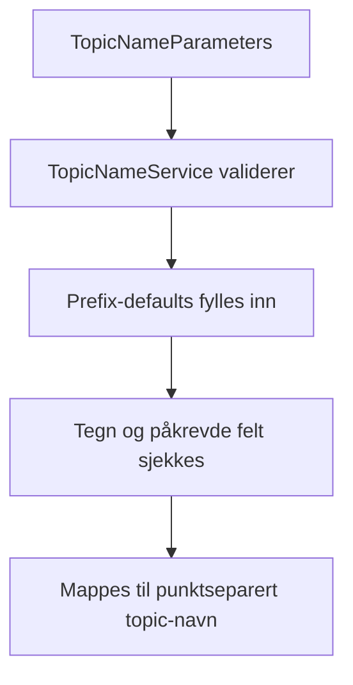

## Producere

### To hovedvalg

- `TemplateFactory`: klassisk `KafkaTemplate<String, VALUE>`
- `ParameterizedTemplateFactory`: sender til topic bygget fra `TopicNameParameters`

### Enkel producer med parameterisert topic

```java
ParameterizedTemplate<MyEvent> template =
    parameterizedTemplateFactory.createTemplate(MyEvent.class);

template.send(
    ParameterizedProducerRecord.<MyEvent>builder()
        .topicNameParameters(
            EventTopicNameParameters.builder()
                .topicNamePrefixParameters(
                    TopicNamePrefixParameters.stepBuilder()
                        .orgId("my-org")
                        .domainContext("my-domain")
                        .build()
                )
                .eventName("student-created")
                .build()
        )
        .key("student-123")
        .value(new MyEvent(...))
        .build()
);
```

### Origin-header

Alle producer-records far header:

- navn: `origin.application.id`
- verdi: `novari.kafka.application-id`

Dette settes via `OriginHeaderProducerInterceptor`.

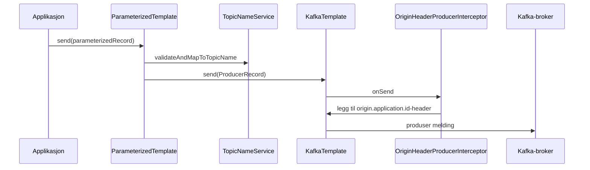

## Consumere

### Fabrikker

- `ListenerContainerFactoryService`
  - `createRecordListenerContainerFactory(...)`
  - `createBatchListenerContainerFactory(...)`
- `ParameterizedListenerContainerFactoryService`
  - samme som over, men med `TopicNameParameters`/pattern i `createContainer(...)`

Containere startes eksplisitt:

```java
ConcurrentMessageListenerContainer<String, MyEvent> container = ...
container.start();
// ...
container.stop();
```

### ListenerConfiguration stepBuilder

Typisk oppsett:

```java
ListenerConfiguration cfg = ListenerConfiguration.stepBuilder()
    .groupIdApplicationDefault()
    .maxPollRecords(100)
    .maxPollInterval(Duration.ofMinutes(10))
    .continueFromPreviousOffsetOnAssignment()
    .build();
```

Støttevalg:

- group id:
  - `groupIdApplicationDefault()`
  - `groupIdApplicationDefaultWithUniqueSuffix()`
  - `groupIdApplicationDefaultWithSuffix(String)`
  - suffix appenderes direkte til `spring.kafka.consumer.group-id` (legg til egen separator hvis du trenger det)
- poll:
  - `maxPollRecordsKafkaDefault()` eller `maxPollRecords(n)`
  - `maxPollIntervalKafkaDefault()` eller `maxPollInterval(duration)`
- assignment:
  - `continueFromPreviousOffsetOnAssignment()`
  - `seekToBeginningOnAssignment()`
  - `onAssignment((assignments, callback) -> ...)`
- optional:
  - `onRevocation(...)`
  - `offsetSeekingTrigger(trigger)`

### Offset assignment-strategier

Fra integrasjonstester:

- `continueFromPreviousOffsetOnAssignment()` fortsetter der committed offset var
- `seekToBeginningOnAssignment()` tvinger lesing fra start for tildelte partitions
- `onAssignment(...)` kan seeke til vilkårlig offset

### OffsetSeekingTrigger

`OffsetSeekingTrigger` kan brukes til runtime-reset:

```java
OffsetSeekingTrigger trigger = new OffsetSeekingTrigger();

ListenerConfiguration cfg = ListenerConfiguration.stepBuilder()
    .groupIdApplicationDefault()
    .maxPollRecordsKafkaDefault()
    .maxPollIntervalKafkaDefault()
    .continueFromPreviousOffsetOnAssignment()
    .offsetSeekingTrigger(trigger)
    .build();

// senere:
trigger.seekToBeginning();
```

## Record-listener vs Batch-listener

### Record-listener

- listener mottar én `ConsumerRecord` av gangen
- ved feil: feilhåndtering skjer record-for-record
- allerede prosesserte records kan committes før retry/recovery av feilende record

### Batch-listener

- listener mottar `List<ConsumerRecord<...>>`
- ved feil avhenger oppførsel av exception-type:
  - `BatchListenerFailedException` med indeks -> biblioteket/Spring kan isolere feilet record i batchen
  - annen exception -> hele batch behandles som feilet enhet

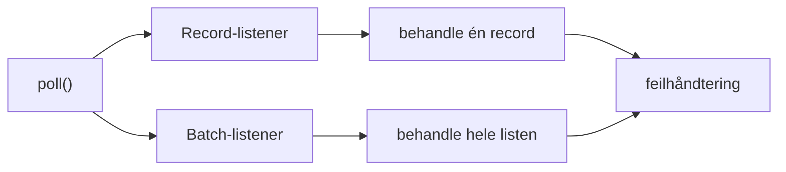

## Feilhåndtering i dybden

`ErrorHandlerFactory` bygger `DefaultErrorHandler` fra `ErrorHandlerConfiguration`.

### Byggesteiner i ErrorHandlerConfiguration.stepBuilder()

1. Retrystrategi:
   - `noRetries()`
   - `retryWithFixedInterval(interval, maxRetries)`
   - `retryWithExponentialInterval(...)`
   - `retryWithBackoffFunction(...)`
2. Klassifisering:
   - `useDefaultRetryClassification()`
   - `excludeExceptionsFromRetry(...)`
   - `retryOnly(...)`
3. Reaksjon på exception-endring:
   - `restartRetryOnExceptionChange()`
   - `continueRetryOnExceptionChange()`
4. Recovery:
   - `skipFailedRecords()`
   - `recoverFailedRecords(...)`
5. Ved recovery-feil:
   - `skipRecordOnRecoveryFailure()`
   - `reprocessAndRetryRecordOnRecoveryFailure()`
   - `reprocessRecordOnRecoveryFailure()`

### Record-listener: flyt ved feil

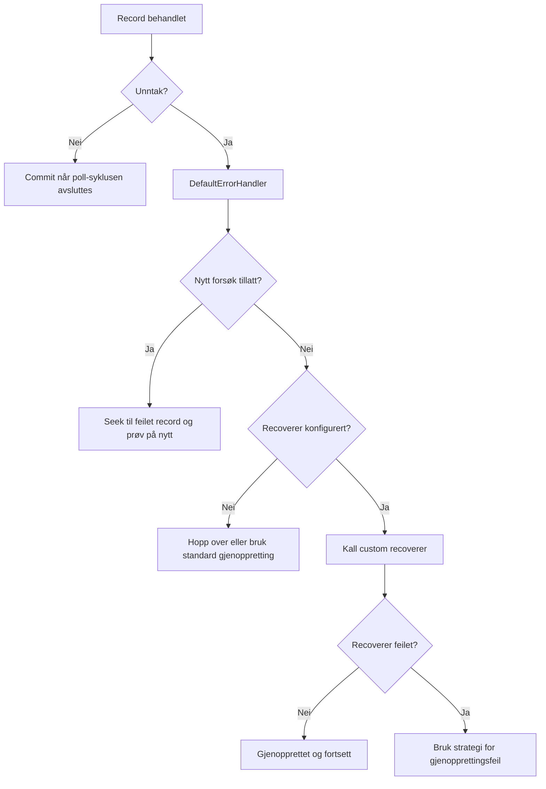

Observerte (testede) record-scenarier:

- retry med fixed backoff fungerer og committer allerede ferdige records
- `excludeExceptionsFromRetry` stopper retry for ekskluderte exceptions
- `retryOnly` tillater retry kun for spesifiserte exceptions
- custom recoverer kan brukes, og ved recoverer-feil styrer recovery-failure-valget videre oppførsel

### Batch-listener: flyt ved `BatchListenerFailedException`

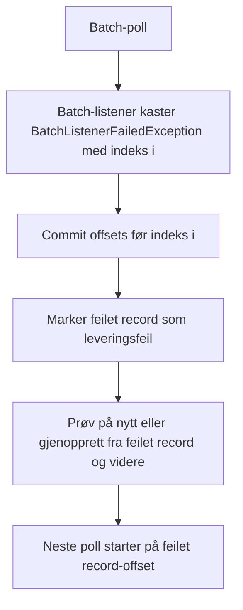

Observerte (testede) batch-scenarier:

- med `BatchListenerFailedException(index)` committes records før feil-indeks
- retry kan starte fra feilet record, ikke nødvendigvis fra batch-start
- med `noRetries + skipFailedRecords` recoveres feilet record og konsumering fortsetter på resten

### Batch-listener: flyt ved annen exception enn `BatchListenerFailedException`

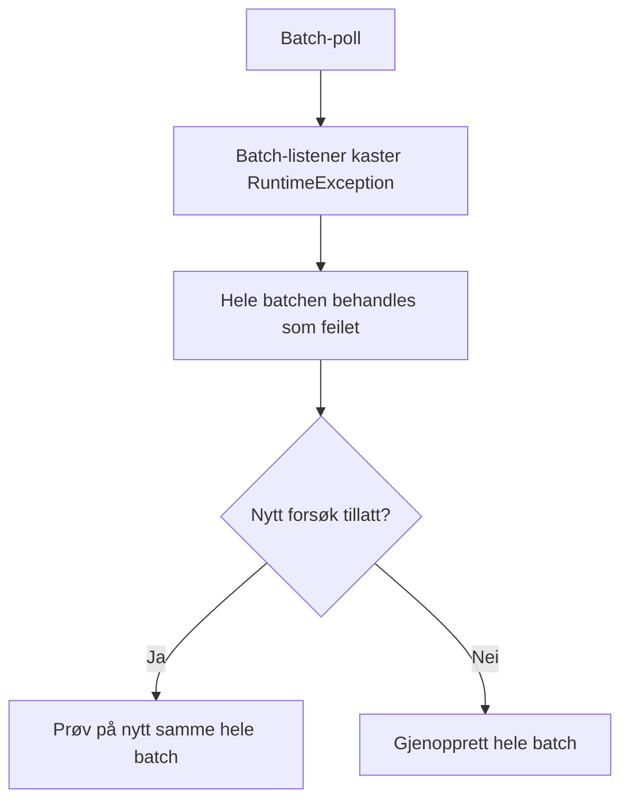

Observerte (testede) batch-scenarier:

- ved generell exception retries hele batchen
- recovery opererer på batch-nivå (og custom recoverer kan bli kalt for hver record i batch under recovery)

## Scenario: batch-consumer med feil midt i batch

Forutsetninger:

- batch-listener
- `maxPollRecordsKafkaDefault()` (Kafka-klientens default er normalt `500`)
- en poll returnerer 56 meldinger med offsets `120..175`
- listener kaster `BatchListenerFailedException` på meldingen med batch-indeks `17` (offset `137`)
- error handler er satt opp for retry med skip/recovery slik at ferdige meldinger committes

Hva skjer:

1. Listener begynner på batchen.
2. Meldinger `120..136` behandles ok.
3. Melding `137` feiler.
4. Offsets for ferdigbehandlede meldinger committes (neste offset blir `137`).
5. Feilet record markeres for retry/recovery.
6. Neste poll starter på `137` og returnerer `137..175` (39 meldinger).
7. Når `137` lykkes/recoveres, fortsetter listener med resten.

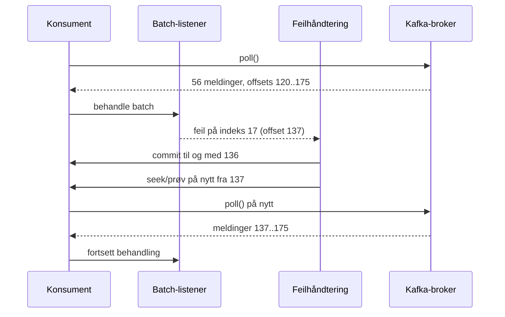

Kontrast:

- Hvis samme batch kaster en vanlig `RuntimeException` uten indeks-info, vil hele batchen normalt retries samlet.

## Kafka-teori: polling, timeouts og offsets

### Poll-loop i praksis

Kafka-consumer lever i en loop:

1. `poll()`
2. prosesser records
3. commit offsets (avhengig av strategi)
4. `poll()` igjen innen gyldig intervall

### `max.poll.records`

- styrer hvor mange records én `poll()` maksimalt returnerer
- lav verdi -> mindre batcher, hyppigere poll/commit
- høy verdi -> større throughput, men større arbeid per poll

I biblioteket:

- settes per container via `ListenerConfiguration.maxPollRecords(...)`
- `maxPollRecordsKafkaDefault()` lar klientdefault gjelde

### `max.poll.interval.ms`

- maks tid mellom vellykkede `poll()`-kall
- hvis prosessering tar for lang tid kan consumer anses "død" av gruppen og partitions rebalanseres

I biblioteket:

- kan settes per container via `ListenerConfiguration.maxPollInterval(...)`

### Offsets og commits

Praktiske observasjoner fra testene:

- record-listener kan committe ferdige records før retry av feilet record
- batch-listener med `BatchListenerFailedException(index)` kan committe ferdig del av batch
- batch-listener med generell exception opererer på hele batchen

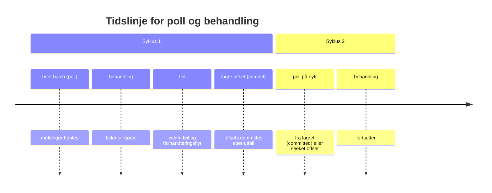

### Grunnleggende Kafka-terminologi

Dette er begrepene som oftest skaper forvirring, og som er nyttige å kunne presist:

| Begrep | Kort forklaring |
|---|---|
| Broker | En Kafka-server som lagrer data og håndterer produce/fetch |
| Cluster | Flere brokers som sammen utgjør Kafka |
| Topic | Logisk datastrøm (f.eks. `org.domain.event.student-created`) |
| Partition | En del av et topic, med egen ordnet logg |
| Record (melding) | En post i loggen: `key`, `value`, timestamp, headers |
| Offset | Løpenummer i en partition (unik innen partitionen) |
| Consumer group | Gruppe av consumere som deler arbeid per partition |
| Committed offset | Siste lagrede lese-posisjon for en consumer group |
| Leader partition | Broker-kopi som tar i mot writes og server reads |
| Replica/follower | Kopi av partition på andre brokers |
| Rebalance | Omfordeling av partitions mellom consumers i en gruppe |
| Retention | Regler for når gamle data skal fjernes |
| Compaction | Beholder siste verdi per nøkkel over tid |

Presisering:

- orden er garantert innen én partition, ikke på tvers av partitions
- offset er ikke global i topicet, bare innen partitionen

### Hvordan Kafka lagrer data på disk

Hver partition er en append-only logg som er delt opp i segmenter.

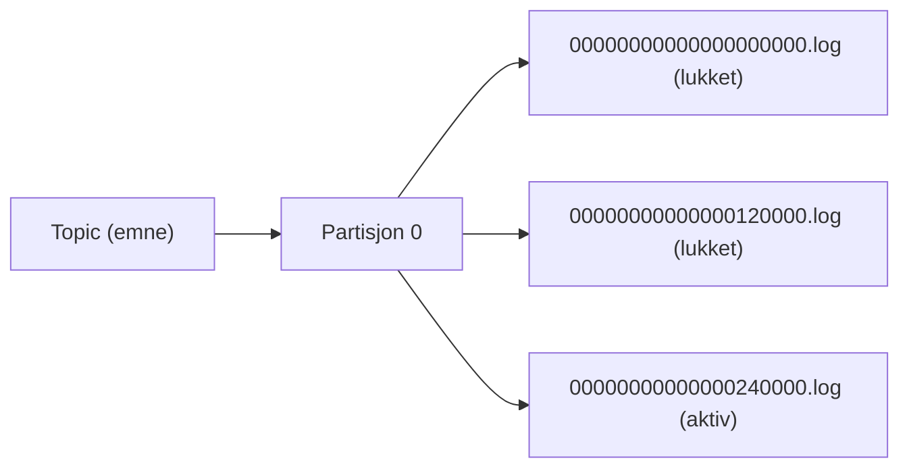

For hvert segment finnes normalt flere filer:

- `*.log` (selve records)
- `*.index` (offset -> posisjon i loggfil)
- `*.timeindex` (timestamp -> offset)
- `*.txnindex` (for transaksjonell Kafka, når relevant)

Viktig konsekvens:

- Kafka sletter og rydder i hovedsak på segment-nivå, ikke record-for-record

### Segment-tid og segment-bytes

To sentrale segment-parametere:

- `segment.ms`: hvor lenge aktivt segment får være åpent før det rulles
- `segment.bytes`: hvor stort aktivt segment kan bli før det rulles

Segmentet rulles når første av grensene nås.

Praktisk tradeoff:

- små segmenter:
  - raskere og mer presis retention/cleanup
  - flere filer og mer metadata-overhead
- store segmenter:
  - færre filer, ofte bedre sekvensiell write/read-effektivitet
  - tregere opprydding og mer "rykkvis" plassfrigjøring

I dette biblioteket:

- `TopicSegmentConfiguration.openSegmentDuration` mappes til `segment.ms`
- `segment.bytes` settes ikke av biblioteket per topic (bruk broker/default eller egen topic-konfig ved behov)

### Når segment-filer blir rotert

Typiske årsaker til segment-roll:

1. aktivt segment blir større enn `segment.bytes`
2. aktivt segment er eldre enn `segment.ms`
3. administrative/driftsmessige hendelser kan også trigge ny segmentsyklus

Når et segment rulles:

- gammelt segment lukkes (immutabelt)
- nytt aktivt segment opprettes
- nye meldinger appendes til nytt segment

Konsekvens for opprydding:

- både delete-retention og compaction jobber mest effektivt på lukkede segmenter

### Null-meldinger og tombstones

En tombstone i Kafka betyr:

- `key` er satt
- `value` er `null`

Semantikk:

- på kompakterte topics betyr tombstone: "denne nøkkelen er slettet"
- stream/stateful consumers bruker dette til å fjerne state for nøkkelen

Viktig:

- tombstones er ikke alltid borte med en gang
- de beholdes minst i `delete.retention.ms` på kompakterte topics for at consumers skal få tid til å se slettingen
- etter dette kan cleaner fjerne både eldre verdier for nøkkelen og tombstone-recorden

For topics uten compaction (`cleanup.policy=delete`):

- `null`-value er bare en vanlig melding med null payload, ikke en "slett nøkkel"-garanti

### Når data faktisk forsvinner fra Kafka

Data forsvinner ikke nødvendigvis med en gang retention-tiden passeres.
Det avhenger av cleanup-policy og segmentgrenser.

#### `cleanup.policy=delete`

Data fjernes når segmenter blir eligible for sletting, typisk basert på:

- `retention.ms` (tid)
- `retention.bytes` (størrelse)
- brokerens periodiske retention-sjekk (f.eks. `log.retention.check.interval.ms`)

Viktig nyanse:

- Kafka sletter hele segmenter
- derfor kan enkelte records leve lenger enn "teoretisk retention", fordi de ligger i et segment som ikke er klart for sletting ennå

#### `cleanup.policy=compact`

Data fjernes gradvis av log cleaner:

- eldre versjoner av samme nøkkel kan fjernes
- siste kjente verdi for hver nøkkel beholdes
- tombstones beholdes i en periode (`delete.retention.ms`) før de også kan fjernes

#### `cleanup.policy=delete,compact`

Begge mekanismer gjelder:

- compaction reduserer historikk per nøkkel
- delete-retention kan i tillegg fjerne eldre segmenter over tid

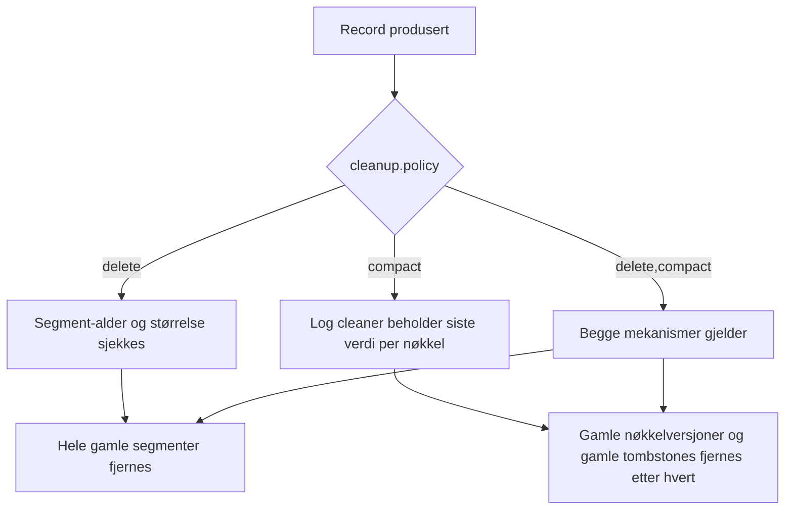

### Log compaction i praksis

Log compaction er Kafka-mekanismen som over tid beholder "siste kjente verdi per nøkkel".

Når et topic har `cleanup.policy=compact`:

- Kafka fjerner eldre versjoner av samme `key`
- siste versjon av hver `key` beholdes
- tombstones (`value=null`) brukes for å markere sletting av nøkler

Dette betyr at compaction er nøkkelbasert:

- uten stabil og meningsfull `key` blir compaction-effekten svak eller uforutsigbar
- med god `key` får du et topic som i praksis kan brukes som "siste state per nøkkel"

#### Hva compaction ikke garanterer

Compaction er asynkron og skjer i bakgrunnen. Derfor:

- du får ikke umiddelbar fjerning av gamle records
- flere versjoner av samme nøkkel kan eksistere samtidig en stund
- gamle records kan være lesbare frem til cleaner faktisk har kjørt

Kort sagt:

- compaction gir eventual cleanup, ikke øyeblikkelig cleanup

#### Hvordan cleaner velger hva som komprimeres

Kafka vurderer lukkede segmenter og cleaner dem når de er "modne" nok.
Nøyaktig tidspunkt påvirkes av blant annet:

- hvor mye "dirty" data som finnes i segmentene
- konfigurasjoner som styrer lag og terskler for compaction
- hvor mye cleaner-kapasitet clusteret har

I bibliotekets topic-modell bruker vi spesielt:

- `max.compaction.lag.ms` (via `TopicCompactCleanupPolicyConfiguration.maxCompactionLag`)
- `delete.retention.ms` for tombstones (via `nullValueRetentionTime`)

Praktisk tolkning:

- `max.compaction.lag.ms` setter en øvre grense for hvor lenge en record kan bli stående ukomprimert
- `delete.retention.ms` bestemmer hvor lenge tombstones beholdes før de kan fjernes

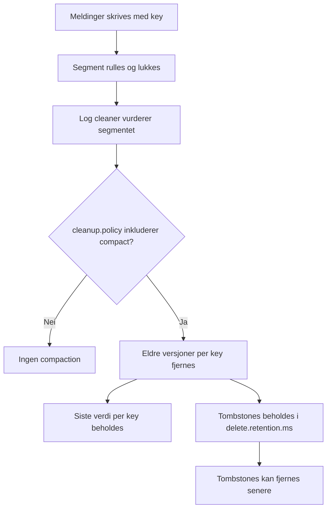

#### Compaction + delete samtidig

Hvis topicet har `cleanup.policy=delete,compact`:

- compaction rydder historikk per nøkkel
- delete-retention kan i tillegg fjerne gamle segmenter tids-/størrelsesbasert

Dette er nyttig når du vil ha:

- "state-lignende" topic (siste verdi per nøkkel)
- men samtidig begrense total diskbruk over tid

### `earliest` vs `latest` på consumere (`auto.offset.reset`)

`auto.offset.reset` brukes når:

- consumer group ikke har committed offset ennå (ny gruppe)
- committed offset er ugyldig (f.eks. data er slettet og offset er utenfor range)

Valgene:

- `earliest`: start fra laveste tilgjengelige offset
- `latest`: start fra log-end (nye meldinger framover)

Merk:

- "earliest" betyr laveste tilgjengelige offset nå, ikke nødvendigvis offset `0` (eldre data kan allerede være slettet)

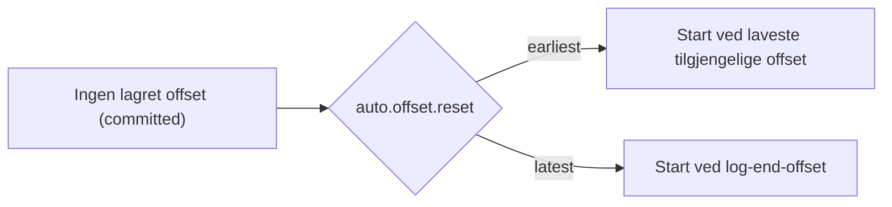

#### Når velge `earliest`

Bruk `earliest` når du vil:

- bygge opp state fra historikk (replay/backfill)
- verifisere at ny tjeneste klarer full historisk prosessering
- være sikker på å få med alt som fortsatt finnes i topicet

Ulempe:

- ny consumer kan måtte lese veldig stor backlog

#### Når velge `latest`

Bruk `latest` når du vil:

- kun prosessere "nye hendelser fra nå"
- unngå historisk backlog for kortlevde/operative consumers

Ulempe:

- du hopper over eksisterende data som allerede ligger i topic ved oppstart

### Hvordan dette henger sammen med dette biblioteket

Bibliotekets `ConsumerConfig` setter default:

- `auto.offset.reset=earliest`

Dette er trygt for replay-scenarier, men kan gi overraskelser:

- hvis du bruker ny group id (f.eks. `groupIdApplicationDefaultWithUniqueSuffix()`), får du i praksis full replay fra tilgjengelig start-offset

Hvis du ønsker `latest` i et konkret consumer-oppsett, kan du overstyre i container-customizer:

```java
ConcurrentMessageListenerContainer<String, MyValue> container =
    listenerContainerFactoryService
        .createRecordListenerContainerFactory(
            MyValue.class,
            record -> { /* ... */ },
            listenerConfiguration,
            errorHandler,
            c -> c.getContainerProperties()
                  .getKafkaConsumerProperties()
                  .setProperty(ConsumerConfig.AUTO_OFFSET_RESET_CONFIG, "latest")
        )
        .createContainer("my-topic");
```

I tillegg kan du velge å overstyre `ConsumerConfig`-bean globalt i applikasjonen.

## Request/Reply

Biblioteket støtter klassisk request/reply over Kafka:

- requester bruker `RequestTemplate`
- responder bruker `RequestListenerContainerFactory`

### Request-side

`RequestTemplateFactory.createTemplate(...)` bygger:

- producer for request
- intern reply-listener-container
- `ReplyingKafkaTemplate` (startes automatisk)

Støttede kall:

- synkront: `requestAndReceive(...)`
- asynkront: `requestWithAsyncReplyConsumer(...)`

Timeout:

- styres av `replyTimeout` i `createTemplate(...)`
- ved timeout ser du `KafkaReplyTimeoutException`

### Reply-side

Responder-flyt:

1. consumer mottar request-record
2. `replyFunction` bygger `ReplyProducerRecord`
3. reply sendes til header `KafkaHeaders.REPLY_TOPIC`
4. `KafkaHeaders.CORRELATION_ID` kopieres til reply

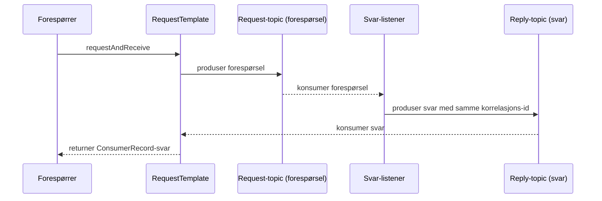

## Topic-oppretting og cleanup policies

### TopicService

`TopicService.createOrModifyTopic(name, TopicConfiguration)` bruker `KafkaAdmin.createOrModifyTopics`.

Konfigurasjoner mappes slik:

| TopicConfiguration | Kafka topic config |
|---|---|
| `deleteCleanupPolicy.retentionTime` | `cleanup.policy=delete` + `retention.ms` |
| `compactCleanupPolicy.maxCompactionLag` | `cleanup.policy` inkluderer `compact` + `max.compaction.lag.ms` |
| `compactCleanupPolicy.nullValueRetentionTime` | `delete.retention.ms` |
| `segmentConfiguration.openSegmentDuration` | `segment.ms` |

### Parameteriserte topic-services

- `EventTopicService`: mapper `EventTopicConfiguration`
- `EntityTopicService`: mapper `EntityTopicConfiguration`
- `ErrorEventTopicService`: event/error-topic
- `RequestTopicService`: request-topic (fast partitions=1, segment=6h)
- `ReplyTopicService`: reply-topic (fast partitions=1, segment=6h)

## Best practices

1. Bruk `stepBuilder` for listener- og error-konfigurasjon.
2. Sett `maxPollRecords` bevisst ut fra payload-størrelse og prosesstid.
3. Kast `BatchListenerFailedException` med riktig indeks i batch-listener hvis du vil ha delvis commit/retry.
4. Bruk `excludeExceptionsFromRetry`/`retryOnly` aktivt for å unngå meningsløs retry.
5. Sett tydelige `groupId`-suffixer for isolerte consumers i tester eller engangsjobber.
6. Hold topic-komponenter lowercase og uten `.`.
7. For kompakterte topics: sett alltid meningsfull `key`, ellers får du dårlig eller uforutsigbar compaction-effekt.
8. Bruk tombstones (`null`-value med key) bevisst hvis du ønsker slettesemantikk i kompakterte topics.
9. Velg `earliest` når replay/historikk er viktig, og `latest` når kun nye hendelser er ønskelig.

## Feilsøking

### "Jeg mottar ikke meldinger"

- sjekk at container faktisk er startet (`container.start()`)
- sjekk group id og om offset allerede er committed
- test med `seekToBeginningOnAssignment()` for å verifisere historiske meldinger

### "Retry oppfører seg ikke som forventet i batch"

- hvis du trenger retry fra et bestemt punkt i batchen, kast `BatchListenerFailedException(index)`
- kastes vanlig exception, forvent retry/recovery på hele batchen

### "Custom recoverer feiler"

- velg strategi eksplisitt:
  - `skipRecordOnRecoveryFailure()`
  - `reprocessAndRetryRecordOnRecoveryFailure()`
  - `reprocessRecordOnRecoveryFailure()`

## API-hurtigreferanse

### Producing

- `TemplateFactory`
- `ParameterizedTemplateFactory`
- `ParameterizedTemplate`
- `ParameterizedProducerRecord`

### Consuming

- `ListenerContainerFactoryService`
- `ParameterizedListenerContainerFactoryService`
- `ListenerConfiguration`
- `ErrorHandlerFactory`
- `ErrorHandlerConfiguration`
- `OffsetSeekingTrigger`

### Topic naming

- `TopicNameService`
- `TopicNamePatternService`
- `TopicNamePrefixParameters`
- `TopicNamePatternPrefixParameters`
- `EventTopicNameParameters`
- `EntityTopicNameParameters`
- `ErrorEventTopicNameParameters`
- `RequestTopicNameParameters`
- `ReplyTopicNameParameters`

### Topic management

- `TopicService`
- `EventTopicService`
- `EntityTopicService`
- `ErrorEventTopicService`
- `RequestTopicService`
- `ReplyTopicService`

### Request/Reply

- `RequestTemplateFactory`
- `RequestTemplate`
- `RequestListenerContainerFactory`
- `RequestListenerConfiguration`
- `RequestProducerRecord`
- `ReplyProducerRecord`

## Oppsummering

Dette biblioteket kombinerer:

- sterk navngivningsmodell for topics
- fleksible, testede feilstrategier for record og batch
- tydelig API for polling/offset-kontroll
- request/reply-mekanismer med correlation-id og timeout-styring

For de fleste brukstilfeller:

- velg `stepBuilder` for konfig
- bruk `ParameterizedTemplate` + `ParameterizedListenerContainerFactory`
- modeller batch-feil eksplisitt med `BatchListenerFailedException(index)` når du trenger delvis commit/retry
