# FINT Kafka Library

[](https://github.com/FINTLabs/fint-kafka/actions/workflows/ci.yaml)

Et Spring Boot-bibliotek for Kafka som gir:

- type-safe producer/consumer-oppsett
- streng og konsistent topic-navngivning
- robust feilhåndtering for record- og batch-listenere
- støtte for request/reply over Kafka
- tjenestelag for oppretting og oppdatering av topics

README-en er skrevet for:

- nybegynnere som trenger begreper forklart
- erfarne Kafka-brukere som vil forstå detaljer i polling, offsets, retry/recovery og runtime-oppførsel

## Innhold

1. [Kom i gang](#kom-i-gang)
2. [Arkitektur](#arkitektur)
3. [Builder vs stepBuilder](#builder-vs-stepbuilder)
4. [Topic-navngivning](#topic-navngivning)
5. [Producere](#producere)
6. [Consumere](#consumere)
7. [Consumer concurrency](#consumer-concurrency)
8. [Record-listener vs Batch-listener](#record-listener-vs-batch-listener)
9. [Feilhåndtering i dybden](#feilh%C3%A5ndtering-i-dybden)
10. [Scenario: batch med 56 meldinger og feil midt i batch](#scenario-batch-med-56-meldinger-og-feil-midt-i-batch)
11. [Kafka-teori: polling, timeouts og offsets](#kafka-teori-polling-timeouts-og-offsets)
12. [Request/Reply](#requestreply)
13. [Topic-oppretting og cleanup policies](#topic-oppretting-og-cleanup-policies)
14. [Helseovervåking (liveness/readiness)](#helseovervåking-livenessreadiness)
15. [Best practices](#best-practices)
16. [Feilsøking](#feilsøking)
17. [API-hurtigreferanse](#api-hurtigreferanse)
18. [Oppgraderingsguider (major-versjoner)](docs/upgrading/README.md)

## Kom i gang

### Avhengighet

Biblioteket publiseres som `no.novari:kafka` (artifact-navn fra prosjektet er `kafka`).

Gradle:

```kotlin
dependencies {
    implementation("no.novari:kafka:<version>")
}
```

### Minimal konfigurasjon

`KafkaConfiguration` auto-konfigureres via Spring Boot (`AutoConfiguration.imports`).

Minstekrav i `application.yml`:

```yaml
spring:
  kafka:
    bootstrap-servers: localhost:9092
    consumer:
      group-id: my-consumer-group

novari:
  kafka:
    application-id: my-app
    default-replicas: 1
    topic:
      org-id: my-org
      domain-context: my-domain

fint:
  kafka:
    enable-ssl: false
```

Viktige nøkler:

- `novari.kafka.application-id` brukes i producer-header `origin.application.id`
- `novari.kafka.default-replicas` brukes ved topic-oppretting (hvis ikke satt, er bibliotekets default `2`)
- `novari.kafka.topic.org-id` + `novari.kafka.topic.domain-context` er defaults i topic-navn
- `fint.kafka.enable-ssl=true` aktiverer SSL-props basert på `spring.kafka.ssl.*`
- consumer default `auto.offset.reset` settes til `earliest` i bibliotekets `ConsumerConfig`-bean

## Arkitektur

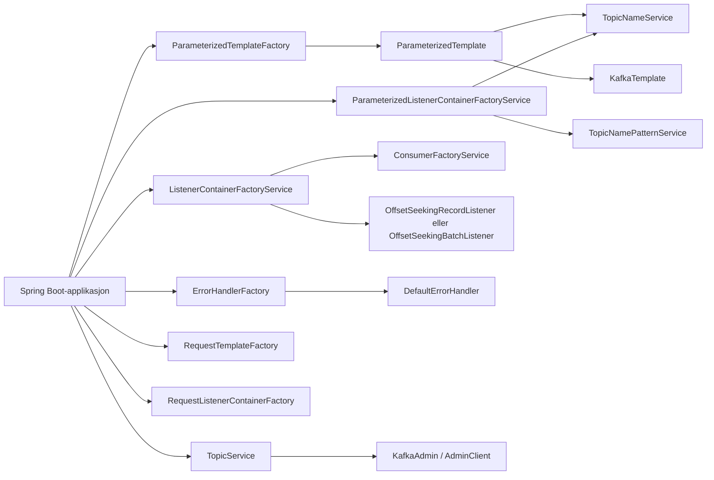
```mermaid
flowchart LR
    App["Spring Boot-applikasjon"] --> PTF["ParameterizedTemplateFactory"]
    App --> LFS["ListenerContainerFactoryService"]
    App --> PLFS["ParameterizedListenerContainerFactoryService"]
    App --> EHF["ErrorHandlerFactory"]
    App --> TS["TopicService"]
    App --> RTS["RequestTemplateFactory"]
    App --> RLFS["RequestListenerContainerFactory"]

    PTF --> PTemp["ParameterizedTemplate"]
    PTemp --> TNS["TopicNameService"]
    PTemp --> KafkaTemplate["KafkaTemplate"]

    PLFS --> TNS
    PLFS --> TNPS["TopicNamePatternService"]
    LFS --> CFS["ConsumerFactoryService"]
    LFS --> OSL["OffsetSeekingRecordListener eller OffsetSeekingBatchListener"]

    EHF --> DEH["DefaultErrorHandler"]

    TS --> Admin["KafkaAdmin / AdminClient"]
```

## Builder vs stepBuilder

Biblioteket bruker begge mønstre:

- `stepBuilder`: guider deg gjennom lovlig rekkefølge av valg (foretrukket i de fleste tilfeller)
- `builder`: rask og fleksibel konstruksjon når du allerede har alle felter

### Hvorfor stepBuilder er foretrukket

- du blir tvunget gjennom viktige beslutninger (f.eks. retry-klassifisering, recovery-strategi)
- vanskeligere å lage delvis ugyldig konfigurasjon
- bedre lesbarhet i kodegjennomgang

### Hva bruker hva

| Kategori                        | Klasser                                                                                                                                                                                            | Kommentar                                  |
|---------------------------------|----------------------------------------------------------------------------------------------------------------------------------------------------------------------------------------------------|--------------------------------------------|
| Kun `stepBuilder`               | `TopicNamePrefixParameters`, `TopicNamePatternPrefixParameters`, `EventTopicConfiguration`, `EntityTopicConfiguration`                                                                             | Designet for trygg, sekvensiell oppbygging |
| Både `builder` og `stepBuilder` | `ListenerConfiguration`, `ErrorHandlerConfiguration`, `RequestListenerConfiguration`                                                                                                               | `stepBuilder` anbefales for normal bruk    |
| Kun `builder`                   | `ParameterizedProducerRecord`, `RequestProducerRecord`, `ReplyProducerRecord`, `TopicConfiguration`, `RequestTopicConfiguration`, `ReplyTopicConfiguration`, samt de fleste `*TopicNameParameters` | Egnet som dataobjekter                     |

Beskrivelse av "noen har bare `builder`, mange har bare `stepBuilder`, og noen har begge":

- i dette biblioteket er det flest sentrale konfig-objekter som bruker `stepBuilder`
- rene payload-/parameter-objekter bruker som regel bare `builder`
- tre sentrale konfig-objekter støtter begge

## Topic-navngivning

### Standard format

Alle topics bygges rundt dette mønsteret:

`<orgId>.<domainContext>.<messageType>.<suffix...>`

Eksempler:

- `my-org.my-domain.event.student-created`
- `my-org.my-domain.entity.student`
- `my-org.my-domain.request.student.by.fnr`
- `my-org.my-domain.reply.my-app.student`
- `my-org.my-domain.event.error.student-sync-failed`

### MessageType

- `EVENT` -> `event`
- `ENTITY` -> `entity`
- `REQUEST` -> `request`
- `REPLY` -> `reply`

### Validering

Biblioteket validerer topic-komponenter:

- obligatoriske felt må være satt
- `orgId` og `domainContext` kan ikke være blanke
- komponenter kan ikke inneholde `.`
- komponenter kan ikke inneholde store bokstaver

Merk: andre tegn er i praksis tillatt av valideringen så lenge de ikke bryter reglene over.

### Defaults for prefix

Hvis du ikke setter `orgId`/`domainContext` eksplisitt i prefix, erstattes de med:

- `novari.kafka.topic.org-id`
- `novari.kafka.topic.domain-context`

### Pattern-baserte subscriptions

`TopicNamePatternService` lager regex-pattern for subscriptions på flere topics.

Eksempel:

```java
EventTopicNamePatternParameters params = EventTopicNamePatternParameters.builder()
    .topicNamePatternPrefixParameters(
        TopicNamePatternPrefixParameters.stepBuilder()
            .orgId(TopicNamePatternParameterPattern.anyOf("org1", "org2"))
            .domainContext(TopicNamePatternParameterPattern.anyOf("school", "hr"))
            .build()
    )
    .eventName(TopicNamePatternParameterPattern.startingWith("student"))
    .build();
```

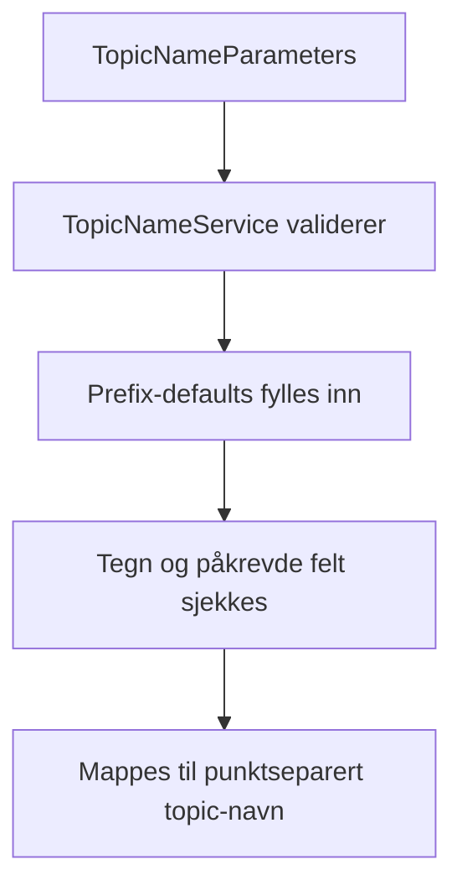
```mermaid
flowchart TD
    A["TopicNameParameters"] --> B["TopicNameService validerer"]
    B --> C["Prefix-defaults fylles inn"]
    C --> D["Tegn og påkrevde felt sjekkes"]
    D --> E["Mappes til punktseparert topic-navn"]
```

## Producere

### To hovedvalg

- `TemplateFactory`: klassisk `KafkaTemplate<String, VALUE>`
- `ParameterizedTemplateFactory`: sender til topic bygget fra `TopicNameParameters`

### Enkel producer med parameterisert topic

```java
ParameterizedTemplate<MyEvent> template =
    parameterizedTemplateFactory.createTemplate(MyEvent.class);

template.send(
    ParameterizedProducerRecord.<MyEvent>builder()
        .topicNameParameters(
            EventTopicNameParameters.builder()
                .topicNamePrefixParameters(
                    TopicNamePrefixParameters.stepBuilder()
                        .orgId("my-org")
                        .domainContext("my-domain")
                        .build()
                )
                .eventName("student-created")
                .build()
        )
        .key("student-123")
        .value(new MyEvent(...))
        .build()
);
```

### Origin-header

Alle producer-records får header:

- navn: `origin.application.id`
- verdi: `novari.kafka.application-id`

Dette settes via `OriginHeaderProducerInterceptor`.

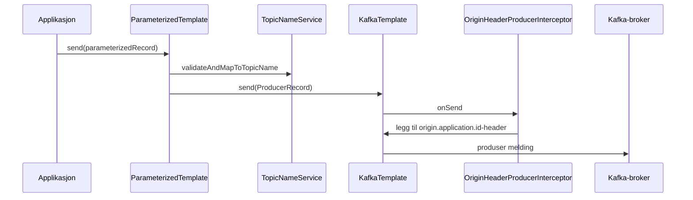
```mermaid
sequenceDiagram
    participant App as Applikasjon
    participant Template as ParameterizedTemplate
    participant TNS as TopicNameService
    participant Kafka as KafkaTemplate
    participant Interceptor as OriginHeaderProducerInterceptor
    participant Broker as Kafka-broker

    App->>Template: send(parameterizedRecord)
    Template->>TNS: validateAndMapToTopicName
    Template->>Kafka: send(ProducerRecord)
    Kafka->>Interceptor: onSend
    Interceptor->>Kafka: legg til origin.application.id-header
    Kafka->>Broker: produser melding
```

## Consumere

### Fabrikker

- `ListenerContainerFactoryService`
  - `createRecordListenerContainerFactory(...)`
  - `createBatchListenerContainerFactory(...)`
- `ParameterizedListenerContainerFactoryService`
  - samme som over, men med `TopicNameParameters`/pattern i `createContainer(...)`

Containere startes eksplisitt:

```java
ConcurrentMessageListenerContainer<String, MyEvent> container = ...
container.start();
// ...
container.stop();
```

### ListenerConfiguration stepBuilder

Typisk oppsett:

```java
ListenerConfiguration cfg = ListenerConfiguration.stepBuilder()
    .groupIdApplicationDefault()
    .maxPollRecords(100)
    .maxPollInterval(Duration.ofMinutes(10))
    .continueFromPreviousOffsetOnAssignment()
    .build();
```

Støttevalg:

- group id:
  - `groupIdApplicationDefault()`
  - `groupIdApplicationDefaultWithUniqueSuffix()`
  - `groupIdApplicationDefaultWithSuffix(String)`
  - suffix appenderes direkte til `spring.kafka.consumer.group-id` (legg til egen separator hvis du trenger det)
- poll:
  - `maxPollRecordsKafkaDefault()` eller `maxPollRecords(n)`
  - `maxPollIntervalKafkaDefault()` eller `maxPollInterval(duration)`
- assignment:
  - `continueFromPreviousOffsetOnAssignment()`
  - `seekToBeginningOnAssignment()`
  - `onAssignment((assignments, callback) -> ...)`
- optional:
  - `onRevocation(...)`
  - `offsetSeekingTrigger(trigger)`

### Hvilket group id-valg bør du ta?

Group id bestemmer hvilken consumer group containeren tilhører, og dermed både lastdeling og offset-håndtering. Dette er et av de viktigste valgene du tar.

#### `groupIdApplicationDefault()`

Normalvalget. Bruker `spring.kafka.consumer.group-id` uendret.

- alle instanser/pods av applikasjonen deler arbeid (partitions fordeles mellom dem)
- consumeren fortsetter fra committed offset etter restart/deploy
- bruk når meldinger skal behandles én gang per applikasjon — typisk all varig prosessering

#### `groupIdApplicationDefaultWithUniqueSuffix()`

Appenderer en tilfeldig UUID til group id ved oppstart, slik at hver instans får sin egen, ferske consumer group hver gang.

Konsekvenser:

- ingen lastdeling — hver instans mottar alle meldinger
- ingen gjenbruk av committed offsets — og siden biblioteket setter `auto.offset.reset=earliest`, får du i praksis full replay fra start av topicet ved hver oppstart

Bruk når:

- hver instans skal bygge opp egen in-memory state/cache fra topicet ved oppstart (typisk mot kompakterte entity-topics, gjerne kombinert med `seekToBeginningOnAssignment()`)
- i tester, der du vil ha en isolert consumer uten gamle offsets

Vær oppmerksom på:

- hver oppstart etterlater en «død» consumer group i clusteret
- full replay ved hver oppstart kan gi lang oppstartstid på store topics

#### `groupIdApplicationDefaultWithSuffix(String)`

Appenderer et fast, valgt suffix. Gir et stabilt, men separat group id.

Bruk når:

- samme applikasjon har flere uavhengige consumere på samme topic, og hver trenger egen offset-tracking (uten suffix ville de delt group id og «stjålet» partitions fra hverandre)
- en listener bevisst skal ha egen leseposisjon uavhengig av applikasjonens øvrige consumere, men fortsatt overleve restarts

Husk: suffixet appenderes direkte til group id uten separator — inkluder den selv (f.eks. `"-cache"`).

#### Oppsummert

| Valg                                          | Lastdeling mellom instanser | Fortsetter etter restart | Replay ved oppstart |
|-----------------------------------------------|-----------------------------|--------------------------|---------------------|
| `groupIdApplicationDefault()`                 | Ja                          | Ja                       | Nei                 |
| `groupIdApplicationDefaultWithUniqueSuffix()` | Nei                         | Nei                      | Ja (full)           |
| `groupIdApplicationDefaultWithSuffix(String)` | Ja (per suffix)             | Ja                       | Nei                 |

### Offset assignment-strategier

Fra integrasjonstester:

- `continueFromPreviousOffsetOnAssignment()` fortsetter der committed offset var
- `seekToBeginningOnAssignment()` tvinger lesing fra start for tildelte partitions
- `onAssignment(...)` kan seeke til vilkårlig offset

#### Når velger du hva?

- `continueFromPreviousOffsetOnAssignment()`: normalvalget for varig prosessering. Consumeren plukker opp der den slapp, og du får ikke dobbeltbehandling utover Kafkas vanlige at-least-once-garanti.
- `seekToBeginningOnAssignment()`: bruk når consumeren skal bygge state fra hele topicet ved hver (re)tildeling av partitions — typisk in-memory cache fra et kompaktert entity-topic. Kombineres som regel med `groupIdApplicationDefaultWithUniqueSuffix()`; de to valgene hører naturlig sammen i cache-scenarier.
- `onAssignment(...)`: escape hatch for spesialtilfeller, f.eks. seek til en bestemt offset eller timestamp. Bruk bare når de to over ikke dekker behovet — kallback-en gir deg `ConsumerSeekCallback` og fullt ansvar.

### OffsetSeekingTrigger

`OffsetSeekingTrigger` kan brukes til runtime-reset. Bruk den når du trenger å lese topicet på nytt uten å restarte applikasjonen — f.eks. et admin-endepunkt som trigger cache-rebuild:

```java
OffsetSeekingTrigger trigger = new OffsetSeekingTrigger();

ListenerConfiguration cfg = ListenerConfiguration.stepBuilder()
    .groupIdApplicationDefault()
    .maxPollRecordsKafkaDefault()
    .maxPollIntervalKafkaDefault()
    .continueFromPreviousOffsetOnAssignment()
    .offsetSeekingTrigger(trigger)
    .build();

// senere:
trigger.seekToBeginning();
```

## Consumer concurrency

`concurrency` betyr hvor mange Kafka-consumer-trader samme listener-container starter i samme consumer group.

Praktisk effekt:

- høyere verdi kan gi bedre throughput
- partitions fordeles mellom flere consumer-instanser
- hvis `concurrency` er høyere enn tilgjengelige partitions, blir overskytende consumers stående uten arbeid

Anbefaling: start med default (1), og øk kun når du faktisk observerer consumer lag og topicet har nok partitions til å utnytte det. Sett aldri høyere enn antall partitions — overskytende trader gjør ingenting, men koster ressurser.

### Sette concurrency via `containerCustomizer` (anbefalt)

```java
ParameterizedListenerContainerFactory<MyEvent> factory =
    parameterizedListenerContainerFactoryService.createRecordListenerContainerFactory(
        MyEvent.class,
        record -> process(record.value()),
        listenerConfiguration,
        errorHandlerFactory.createErrorHandler(
            ErrorHandlerConfiguration.<MyEvent>stepBuilder()
                .noRetries()
                .skipFailedRecords()
                .build()
        ),
        container -> container.setConcurrency(6)
    );

ConcurrentMessageListenerContainer<String, MyEvent> container =
    factory.createContainer(topicNameParameters);
container.start();
```

### Alternativ: sett på containeren før `start()`

```java
ConcurrentMessageListenerContainer<String, MyEvent> container =
    parameterizedListenerContainerFactoryService
        .createRecordListenerContainerFactory(
            MyEvent.class,
            record -> process(record.value()),
            listenerConfiguration,
            errorHandler
        )
        .createContainer(topicNameParameters);

container.setConcurrency(6);
container.start();
```

### Begrensninger og viktige regler

- `concurrency` bør normalt være `<=` antall partitions du lytter på (for én consumer group).
- med flere topics/patterns er effektiv øvre grense summen av tildelbare partitions for consumer groupen.
- sett helst `concurrency` før `start()`; endringer i runtime kan kreve restart for forutsigbar oppførsel.
- høy concurrency øker ressursbruk (flere forbindelser, mer minne, flere poll-looper, mer rebalance-kostnad).
- Kafka garanterer rekkefølge per partition, ikke på tvers av partitions.
- `RequestTopicService` og `ReplyTopicService` oppretter topics med `partitions=1` i biblioteket; da gir `concurrency > 1` vanligvis ingen økt parallellitet for disse topicene.

## Record-listener vs Batch-listener

### Record-listener

- listener mottar én `ConsumerRecord` av gangen
- ved feil: feilhåndtering skjer record-for-record
- allerede prosesserte records kan committes før retry/recovery av feilende record

### Batch-listener

- listener mottar `List<ConsumerRecord<...>>`
- ved feil avhenger oppførsel av exception-type:
  - `BatchListenerFailedException` med indeks -> biblioteket/Spring kan isolere feilet record i batchen
  - annen exception -> hele batch behandles som feilet enhet

### Når velger du hva?

- **Record-listener**: når hver melding behandles selvstendig og du vil ha enkel, presis feilhåndtering per melding. Dette er normalvalget.
- **Batch-listener**: når throughput er viktig og meldinger kan behandles samlet — typisk bulk-operasjoner som batch-insert mot database. Prisen er at du selv må kaste `BatchListenerFailedException(index)` ved feil for å få presis feilhåndtering; ellers behandles hele batchen som feilet.

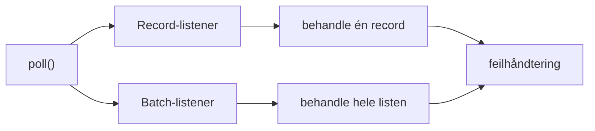
```mermaid
flowchart LR
    P["poll()"] --> R["Record-listener"]
    P --> B["Batch-listener"]
    R --> R1["behandle én record"]
    B --> B1["behandle hele listen"]
    R1 --> E["feilhåndtering"]
    B1 --> E
```

## Feilhåndtering i dybden

`ErrorHandlerFactory` bygger `DefaultErrorHandler` fra `ErrorHandlerConfiguration`.

### Byggesteiner i ErrorHandlerConfiguration.stepBuilder()

1. Retrystrategi:
   - `noRetries()`
   - `retryWithFixedInterval(interval, maxRetries)`
   - `retryWithExponentialInterval(...)`
   - `retryWithBackoffFunction(...)`
2. Klassifisering:
   - `useDefaultRetryClassification()`
   - `excludeExceptionsFromRetry(...)`
   - `retryOnly(...)`
3. Reaksjon på exception-endring:
   - `restartRetryOnExceptionChange()`
   - `continueRetryOnExceptionChange()`
4. Recovery:
   - `skipFailedRecords()`
   - `recoverFailedRecords(...)`
5. Ved recovery-feil:
   - `skipRecordOnRecoveryFailure()`
   - `reprocessAndRetryRecordOnRecoveryFailure()`
   - `reprocessRecordOnRecoveryFailure()`

### Beslutningsguide: hvilke valg passer når?

Viktig bakteppe for alle valgene: retry blokkerer partitionen. Så lenge en record retries, behandles ingen meldinger bak den i samme partition. Lange retry-løp gir derfor økende lag for alt annet.

#### 1. Retrystrategi

- `noRetries()`: når feil er deterministiske (f.eks. valideringsfeil — samme input feiler alltid), eller når recovery-steget håndterer alt likevel. Retry av en feil som garantert skjer igjen er bare bortkastet tid.
- `retryWithFixedInterval(interval, maxRetries)`: når feil typisk er korte og forbigående (nettverksglipp, kortvarig låsing). Hold intervallet kort og antall forsøk lavt.
- `retryWithExponentialInterval(...)`: når nedstrøms tjeneste kan være nede over lengre tid. Eksponentiell backoff unngår å hamre på en tjeneste som sliter, samtidig som du gir den tid til å komme seg.
- `retryWithBackoffFunction(...)`: kun når retry-oppførselen må avhenge av selve recorden eller exception-typen. Sjelden nødvendig — prøv de andre først.

#### 2. Klassifisering

- Bruk `excludeExceptionsFromRetry(...)` eller `retryOnly(...)` aktivt. Deterministiske feil (f.eks. deserialiserings- eller valideringsfeil) bør ekskluderes fra retry — de blokkerer bare partitionen uten håp om å lykkes.
- `useDefaultRetryClassification()` passer når alle feil du forventer er transiente.

#### 3. Reaksjon på exception-endring

- `restartRetryOnExceptionChange()`: godt default. Ny exception-type betyr ofte et nytt problem som fortjener egne forsøk.
- `continueRetryOnExceptionChange()`: når total retrytid må være begrenset og forutsigbar, uavhengig av hva som feiler underveis.

#### 4. Recovery

- `skipFailedRecords()`: når tap av enkeltmeldinger er akseptabelt (f.eks. metrikker, ikke-kritiske hendelser). Recorden logges og hoppes over.
- `recoverFailedRecords(...)`: når feilede meldinger må tas vare på — skriv til error-topic, lagre i database eller varsle. Velg dette hvis du noensinne skal kunne svare på «hva skjedde med melding X?».

#### 5. Ved recovery-feil

- `skipRecordOnRecoveryFailure()`: når fremdrift er viktigere enn komplett behandling. Konsumeringen fortsetter selv om recovery feilet.
- `reprocessAndRetryRecordOnRecoveryFailure()`: når ingen meldinger får gå tapt. NB: en «poison pill» (record som alltid feiler i både behandling og recovery) vil da blokkere partitionen på ubestemt tid.
- `reprocessRecordOnRecoveryFailure()`: mellomting — recorden behandles på nytt én gang uten at hele retry-løpet startes om.

### Record-listener: flyt ved feil

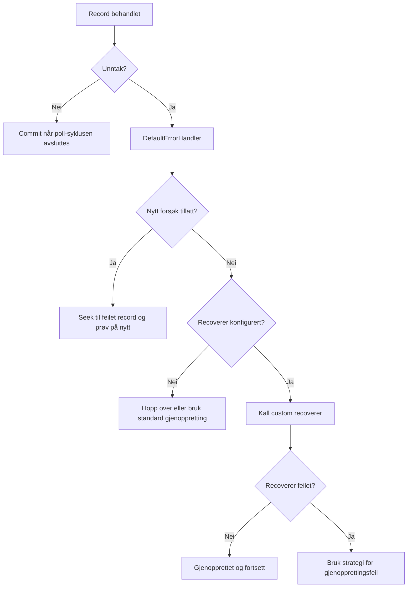
```mermaid
flowchart TD
    A["Record behandlet"] --> B{"Unntak?"}
    B -->|Nei| C["Commit når poll-syklusen avsluttes"]
    B -->|Ja| D["DefaultErrorHandler"]
    D --> E{"Nytt forsøk tillatt?"}
    E -->|Ja| F["Seek til feilet record og prøv på nytt"]
    E -->|Nei| G{"Recoverer konfigurert?"}
    G -->|Nei| H["Hopp over eller bruk standard gjenoppretting"]
    G -->|Ja| I["Kall custom recoverer"]
    I --> J{"Recoverer feilet?"}
    J -->|Nei| K["Gjenopprettet og fortsett"]
    J -->|Ja| L["Bruk strategi for gjenopprettingsfeil"]
```

Observerte (testede) record-scenarier:

- retry med fixed backoff fungerer og committer allerede ferdige records
- `excludeExceptionsFromRetry` stopper retry for ekskluderte exceptions
- `retryOnly` tillater retry kun for spesifiserte exceptions
- custom recoverer kan brukes, og ved recoverer-feil styrer recovery-failure-valget videre oppførsel

### Batch-listener: flyt ved `BatchListenerFailedException`

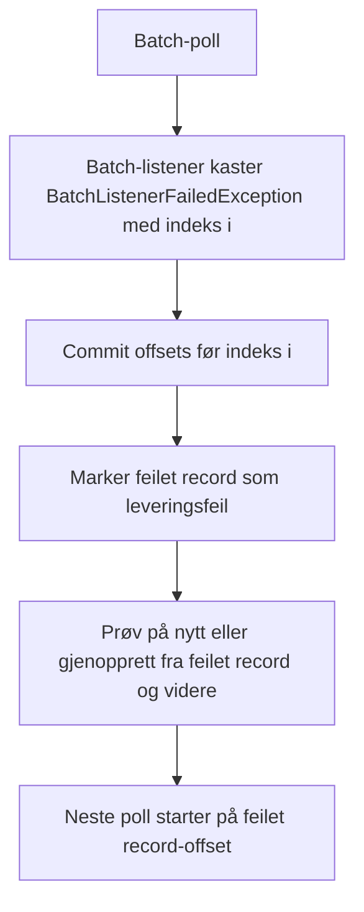
```mermaid
flowchart TD
    A["Batch-poll"] --> B["Batch-listener kaster BatchListenerFailedException med indeks i"]
    B --> C["Commit offsets før indeks i"]
    C --> D["Marker feilet record som leveringsfeil"]
    D --> E["Prøv på nytt eller gjenopprett fra feilet record og videre"]
    E --> F["Neste poll starter på feilet record-offset"]
```

Observerte (testede) batch-scenarier:

- med `BatchListenerFailedException(index)` committes records før feil-indeks
- retry kan starte fra feilet record, ikke nødvendigvis fra batch-start
- med `noRetries + skipFailedRecords` recoveres feilet record og konsumering fortsetter på resten

### Batch-listener: flyt ved annen exception enn `BatchListenerFailedException`

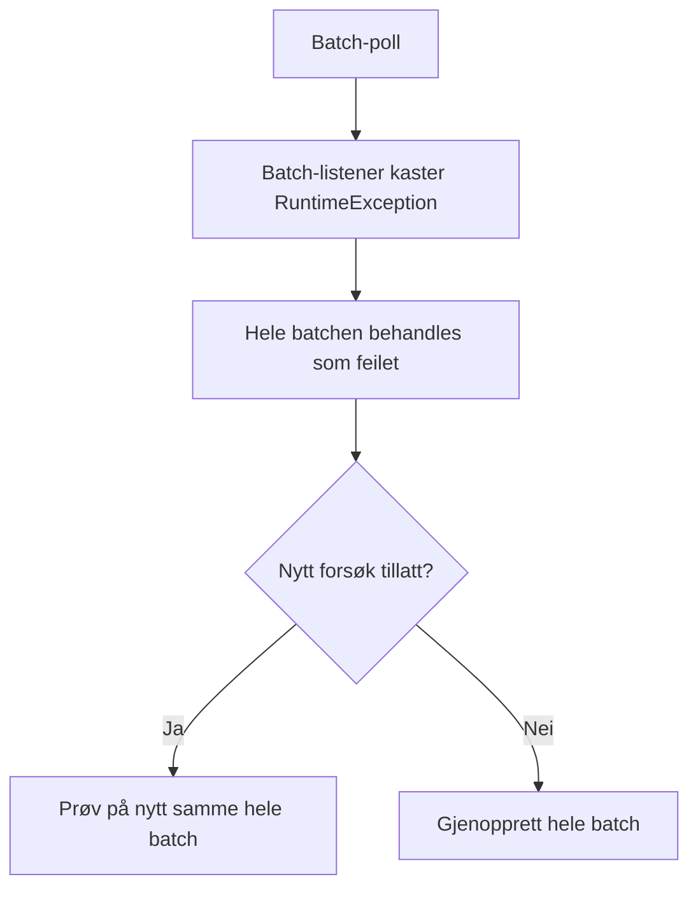
```mermaid
flowchart TD
    A["Batch-poll"] --> B["Batch-listener kaster RuntimeException"]
    B --> C["Hele batchen behandles som feilet"]
    C --> D{"Nytt forsøk tillatt?"}
    D -->|Ja| E["Prøv på nytt samme hele batch"]
    D -->|Nei| F["Gjenopprett hele batch"]
```

Observerte (testede) batch-scenarier:

- ved generell exception retries hele batchen
- recovery opererer på batch-nivå (og custom recoverer kan bli kalt for hver record i batch under recovery)

## Scenario: batch-consumer med feil midt i batch

Forutsetninger:

- batch-listener
- `maxPollRecordsKafkaDefault()` (Kafka-klientens default er normalt `500`)
- en poll returnerer 56 meldinger med offsets `120..175`
- listener kaster `BatchListenerFailedException` på meldingen med batch-indeks `17` (offset `137`)
- error handler er satt opp for retry med skip/recovery slik at ferdige meldinger committes

Hva skjer:

1. Listener begynner på batchen.
2. Meldinger `120..136` behandles ok.
3. Melding `137` feiler.
4. Offsets for ferdigbehandlede meldinger committes (neste offset blir `137`).
5. Feilet record markeres for retry/recovery.
6. Neste poll starter på `137` og returnerer `137..175` (39 meldinger).
7. Når `137` lykkes/recoveres, fortsetter listener med resten.

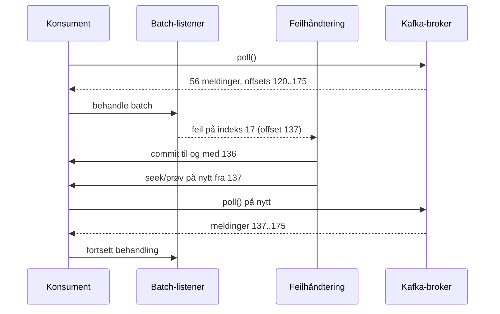
```mermaid
sequenceDiagram
    participant C as Konsument
    participant L as Batch-listener
    participant EH as Feilhåndtering
    participant B as Kafka-broker

    C->>B: poll()
    B-->>C: 56 meldinger, offsets 120..175
    C->>L: behandle batch
    L-->>EH: feil på indeks 17 (offset 137)
    EH->>C: commit til og med 136
    EH->>C: seek/prøv på nytt fra 137
    C->>B: poll() på nytt
    B-->>C: meldinger 137..175
    C->>L: fortsett behandling
```

Kontrast:

- Hvis samme batch kaster en vanlig `RuntimeException` uten indeks-info, vil hele batchen normalt retries samlet.

## Kafka-teori: polling, timeouts og offsets

### Poll-loop i praksis

Kafka-consumer lever i en loop:

1. `poll()`
2. prosesser records
3. commit offsets (avhengig av strategi)
4. `poll()` igjen innen gyldig intervall

### `max.poll.records`

- styrer hvor mange records én `poll()` maksimalt returnerer
- lav verdi -> mindre batcher, hyppigere poll/commit
- høy verdi -> større throughput, men større arbeid per poll

I biblioteket:

- settes per container via `ListenerConfiguration.maxPollRecords(...)`
- `maxPollRecordsKafkaDefault()` lar klientdefault gjelde

### `max.poll.interval.ms`

- maks tid mellom vellykkede `poll()`-kall
- hvis prosessering tar for lang tid kan consumer anses "død" av gruppen og partitions rebalanseres

I biblioteket:

- kan settes per container via `ListenerConfiguration.maxPollInterval(...)`

### Tommelfingerregel for poll-konfigurasjon

`maxPollInterval` må være romslig større enn `maxPollRecords × verste behandlingstid per record`. Brytes dette, antar gruppen at consumeren er død: partitions rebalanseres, og meldingene i den avbrutte pollen behandles på nytt av en annen consumer (dobbeltbehandling).

Praktisk:

- rask prosessering (millisekunder per record): bruk `maxPollRecordsKafkaDefault()` og `maxPollIntervalKafkaDefault()` — defaults (500 records / 5 minutter) gir god margin
- tung prosessering per record (eksterne kall, store skriveoperasjoner): sett `maxPollRecords` eksplisitt ned, og øk eventuelt `maxPollInterval`
- eksempel: 100 records × 5 sekunder verste fall = ~8,3 minutter — da er default-intervallet på 5 minutter for kort

### Offsets og commits

Praktiske observasjoner fra testene:

- record-listener kan committe ferdige records før retry av feilet record
- batch-listener med `BatchListenerFailedException(index)` kan committe ferdig del av batch
- batch-listener med generell exception opererer på hele batchen

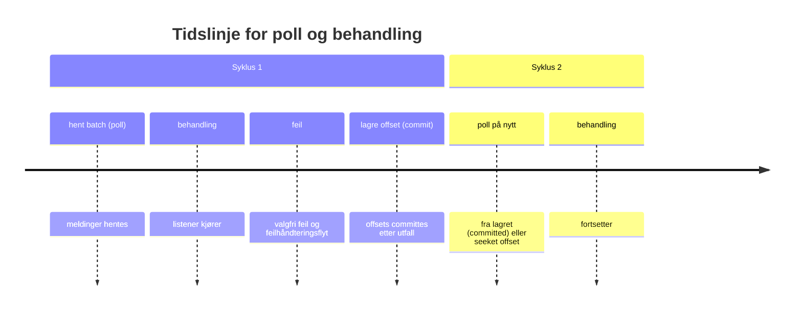
```mermaid
timeline
    title Tidslinje for poll og behandling
    section Syklus 1
      hent batch (poll) : meldinger hentes
      behandling : listener kjører
      feil : valgfri feil og feilhåndteringsflyt
      lagre offset (commit) : offsets committes etter utfall
    section Syklus 2
      poll på nytt : fra lagret (committed) eller seeket offset
      behandling : fortsetter
```

### Grunnleggende Kafka-terminologi

Dette er begrepene som oftest skaper forvirring, og som er nyttige å kunne presist:

| Begrep           | Kort forklaring                                              |
|------------------|--------------------------------------------------------------|
| Broker           | En Kafka-server som lagrer data og håndterer produce/fetch   |
| Cluster          | Flere brokers som sammen utgjør Kafka                        |
| Topic            | Logisk datastrøm (f.eks. `org.domain.event.student-created`) |
| Partition        | En del av et topic, med egen ordnet logg                     |
| Record (melding) | En post i loggen: `key`, `value`, timestamp, headers         |
| Offset           | Løpenummer i en partition (unik innen partitionen)           |
| Consumer group   | Gruppe av consumere som deler arbeid per partition           |
| Committed offset | Siste lagrede lese-posisjon for en consumer group            |
| Leader partition | Broker-kopi som tar i mot writes og server reads             |
| Replica/follower | Kopi av partition på andre brokers                           |
| Rebalance        | Omfordeling av partitions mellom consumers i en gruppe       |
| Retention        | Regler for når gamle data skal fjernes                       |
| Compaction       | Beholder siste verdi per nøkkel over tid                     |

Presisering:

- orden er garantert innen én partition, ikke på tvers av partitions
- offset er ikke global i topicet, bare innen partitionen

### Hvordan Kafka lagrer data på disk

Hver partition er en append-only logg som er delt opp i segmenter.

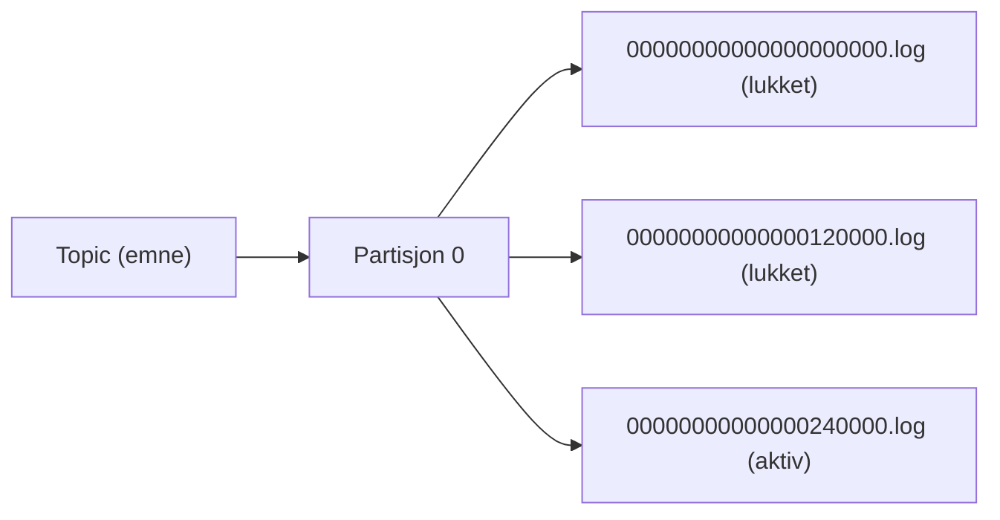
```mermaid
flowchart LR
    T["Topic (emne)"] --> P0["Partisjon 0"]
    P0 --> S0["00000000000000000000.log (lukket)"]
    P0 --> S1["00000000000000120000.log (lukket)"]
    P0 --> S2["00000000000000240000.log (aktiv)"]
```

For hvert segment finnes normalt flere filer:

- `*.log` (selve records)
- `*.index` (offset -> posisjon i loggfil)
- `*.timeindex` (timestamp -> offset)
- `*.txnindex` (for transaksjonell Kafka, når relevant)

Viktig konsekvens:

- Kafka sletter og rydder i hovedsak på segment-nivå, ikke record-for-record

### Segment-tid og segment-bytes

To sentrale segment-parametere:

- `segment.ms`: hvor lenge aktivt segment får være åpent før det rulles
- `segment.bytes`: hvor stort aktivt segment kan bli før det rulles

Segmentet rulles når første av grensene nås.

Praktisk tradeoff:

- små segmenter:
  - raskere og mer presis retention/cleanup
  - flere filer og mer metadata-overhead
- store segmenter:
  - færre filer, ofte bedre sekvensiell write/read-effektivitet
  - tregere opprydding og mer "rykkvis" plassfrigjøring

I dette biblioteket:

- `TopicSegmentConfiguration.openSegmentDuration` mappes til `segment.ms`
- `segment.bytes` settes ikke av biblioteket per topic (bruk broker/default eller egen topic-konfig ved behov)

### Når segment-filer blir rotert

Typiske årsaker til segment-roll:

1. aktivt segment blir større enn `segment.bytes`
2. aktivt segment er eldre enn `segment.ms`
3. administrative/driftsmessige hendelser kan også trigge ny segmentsyklus

Når et segment rulles:

- gammelt segment lukkes (immutabelt)
- nytt aktivt segment opprettes
- nye meldinger appendes til nytt segment

Konsekvens for opprydding:

- både delete-retention og compaction jobber mest effektivt på lukkede segmenter

### Null-meldinger og tombstones

En tombstone i Kafka betyr:

- `key` er satt
- `value` er `null`

Semantikk:

- på kompakterte topics betyr tombstone: "denne nøkkelen er slettet"
- stream/stateful consumers bruker dette til å fjerne state for nøkkelen

Viktig:

- tombstones er ikke alltid borte med en gang
- de beholdes minst i `delete.retention.ms` på kompakterte topics for at consumers skal få tid til å se slettingen
- etter dette kan cleaner fjerne både eldre verdier for nøkkelen og tombstone-recorden

For topics uten compaction (`cleanup.policy=delete`):

- `null`-value er bare en vanlig melding med null payload, ikke en "slett nøkkel"-garanti

### Når data faktisk forsvinner fra Kafka

Data forsvinner ikke nødvendigvis med en gang retention-tiden passeres.
Det avhenger av cleanup-policy og segmentgrenser.

#### `cleanup.policy=delete`

Data fjernes når segmenter blir eligible for sletting, typisk basert på:

- `retention.ms` (tid)
- `retention.bytes` (størrelse)
- brokerens periodiske retention-sjekk (f.eks. `log.retention.check.interval.ms`)

Viktig nyanse:

- Kafka sletter hele segmenter
- derfor kan enkelte records leve lenger enn "teoretisk retention", fordi de ligger i et segment som ikke er klart for sletting ennå

#### `cleanup.policy=compact`

Data fjernes gradvis av log cleaner:

- eldre versjoner av samme nøkkel kan fjernes
- siste kjente verdi for hver nøkkel beholdes
- tombstones beholdes i en periode (`delete.retention.ms`) før de også kan fjernes

#### `cleanup.policy=delete,compact`

Begge mekanismer gjelder:

- compaction reduserer historikk per nøkkel
- delete-retention kan i tillegg fjerne eldre segmenter over tid

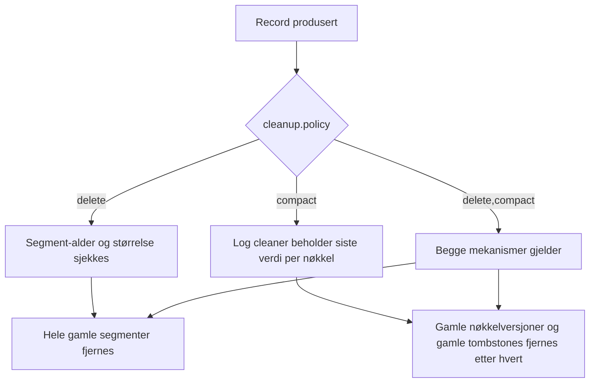
```mermaid
flowchart TD
    A["Record produsert"] --> B{"cleanup.policy"}
    B -->|delete| C["Segment-alder og størrelse sjekkes"]
    B -->|compact| D["Log cleaner beholder siste verdi per nøkkel"]
    B -->|delete,compact| E["Begge mekanismer gjelder"]
    C --> F["Hele gamle segmenter fjernes"]
    D --> G["Gamle nøkkelversjoner og gamle tombstones fjernes etter hvert"]
    E --> F
    E --> G
```

### Log compaction i praksis

Log compaction er Kafka-mekanismen som over tid beholder "siste kjente verdi per nøkkel".

Når et topic har `cleanup.policy=compact`:

- Kafka fjerner eldre versjoner av samme `key`
- siste versjon av hver `key` beholdes
- tombstones (`value=null`) brukes for å markere sletting av nøkler

Dette betyr at compaction er nøkkelbasert:

- uten stabil og meningsfull `key` blir compaction-effekten svak eller uforutsigbar
- med god `key` får du et topic som i praksis kan brukes som "siste state per nøkkel"

#### Hva compaction ikke garanterer

Compaction er asynkron og skjer i bakgrunnen. Derfor:

- du får ikke umiddelbar fjerning av gamle records
- flere versjoner av samme nøkkel kan eksistere samtidig en stund
- gamle records kan være lesbare frem til cleaner faktisk har kjørt

Kort sagt:

- compaction gir eventual cleanup, ikke øyeblikkelig cleanup

#### Hvordan cleaner velger hva som komprimeres

Kafka vurderer lukkede segmenter og cleaner dem når de er "modne" nok.
Nøyaktig tidspunkt påvirkes av blant annet:

- hvor mye "dirty" data som finnes i segmentene
- konfigurasjoner som styrer lag og terskler for compaction
- hvor mye cleaner-kapasitet clusteret har

I bibliotekets topic-modell bruker vi spesielt:

- `max.compaction.lag.ms` (via `TopicCompactCleanupPolicyConfiguration.maxCompactionLag`)
- `delete.retention.ms` for tombstones (via `nullValueRetentionTime`)

Praktisk tolkning:

- `max.compaction.lag.ms` setter en øvre grense for hvor lenge en record kan bli stående ukomprimert
- `delete.retention.ms` bestemmer hvor lenge tombstones beholdes før de kan fjernes

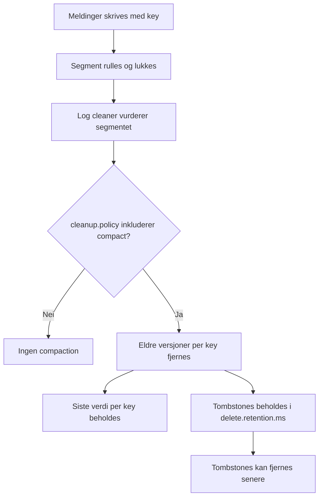
```mermaid
flowchart TD
    A["Meldinger skrives med key"] --> B["Segment rulles og lukkes"]
    B --> C["Log cleaner vurderer segmentet"]
    C --> D{"cleanup.policy inkluderer compact?"}
    D -->|Nei| E["Ingen compaction"]
    D -->|Ja| F["Eldre versjoner per key fjernes"]
    F --> G["Siste verdi per key beholdes"]
    F --> H["Tombstones beholdes i delete.retention.ms"]
    H --> I["Tombstones kan fjernes senere"]
```

#### Compaction + delete samtidig

Hvis topicet har `cleanup.policy=delete,compact`:

- compaction rydder historikk per nøkkel
- delete-retention kan i tillegg fjerne gamle segmenter tids-/størrelsesbasert

Dette er nyttig når du vil ha:

- "state-lignende" topic (siste verdi per nøkkel)
- men samtidig begrense total diskbruk over tid

### `earliest` vs `latest` på consumere (`auto.offset.reset`)

`auto.offset.reset` brukes når:

- consumer group ikke har committed offset ennå (ny gruppe)
- committed offset er ugyldig (f.eks. data er slettet og offset er utenfor range)

Valgene:

- `earliest`: start fra laveste tilgjengelige offset
- `latest`: start fra log-end (nye meldinger framover)

Merk:

- "earliest" betyr laveste tilgjengelige offset nå, ikke nødvendigvis offset `0` (eldre data kan allerede være slettet)

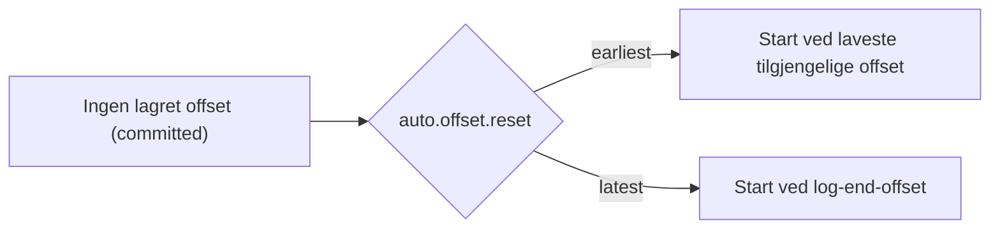
```mermaid
flowchart LR
    A["Ingen lagret offset (committed)"] --> B{"auto.offset.reset"}
    B -->|earliest| C["Start ved laveste tilgjengelige offset"]
    B -->|latest| D["Start ved log-end-offset"]
```

#### Når velge `earliest`

Bruk `earliest` når du vil:

- bygge opp state fra historikk (replay/backfill)
- verifisere at ny tjeneste klarer full historisk prosessering
- være sikker på å få med alt som fortsatt finnes i topicet

Ulempe:

- ny consumer kan måtte lese veldig stor backlog

#### Når velge `latest`

Bruk `latest` når du vil:

- kun prosessere "nye hendelser fra nå"
- unngå historisk backlog for kortlevde/operative consumers

Ulempe:

- du hopper over eksisterende data som allerede ligger i topic ved oppstart

### Hvordan dette henger sammen med dette biblioteket

Bibliotekets `ConsumerConfig` setter default:

- `auto.offset.reset=earliest`

Dette er trygt for replay-scenarier, men kan gi overraskelser:

- hvis du bruker ny group id (f.eks. `groupIdApplicationDefaultWithUniqueSuffix()`), får du i praksis full replay fra tilgjengelig start-offset

Hvis du ønsker `latest` i et konkret consumer-oppsett, kan du overstyre i container-customizer:

```java
ConcurrentMessageListenerContainer<String, MyValue> container =
    listenerContainerFactoryService
        .createRecordListenerContainerFactory(
            MyValue.class,
            record -> { /* ... */ },
            listenerConfiguration,
            errorHandler,
            c -> c.getContainerProperties()
                  .getKafkaConsumerProperties()
                  .setProperty(ConsumerConfig.AUTO_OFFSET_RESET_CONFIG, "latest")
        )
        .createContainer("my-topic");
```

I tillegg kan du velge å overstyre `ConsumerConfig`-bean globalt i applikasjonen.

## Request/Reply

Biblioteket støtter klassisk request/reply over Kafka:

- requester bruker `RequestTemplate`
- responder bruker `RequestListenerContainerFactory`

### Request-side

`RequestTemplateFactory.createTemplate(...)` bygger:

- producer for request
- intern reply-listener-container
- `ReplyingKafkaTemplate` (startes automatisk)

Støttede kall:

- synkront: `requestAndReceive(...)`
- asynkront: `requestWithAsyncReplyConsumer(...)`

Timeout:

- styres av `replyTimeout` i `createTemplate(...)`
- ved timeout ser du `KafkaReplyTimeoutException`

### Reply-side

Responder-flyt:

1. consumer mottar request-record
2. `replyFunction` bygger `ReplyProducerRecord`
3. reply sendes til header `KafkaHeaders.REPLY_TOPIC`
4. `KafkaHeaders.CORRELATION_ID` kopieres til reply

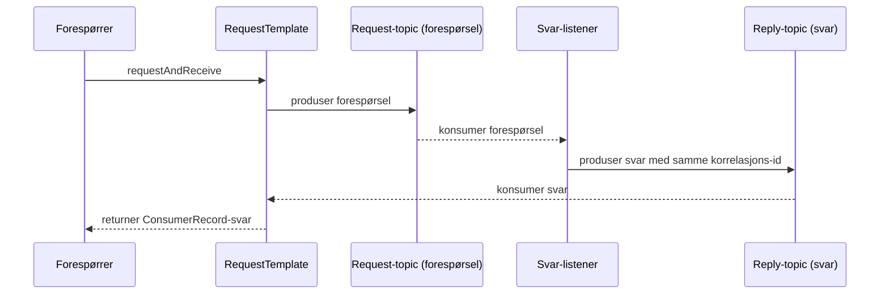
```mermaid
sequenceDiagram
    participant Req as Forespørrer
    participant RT as RequestTemplate
    participant TopicReq as Request-topic (forespørsel)
    participant Resp as Svar-listener
    participant TopicRep as Reply-topic (svar)

    Req->>RT: requestAndReceive
    RT->>TopicReq: produser forespørsel
    TopicReq-->>Resp: konsumer forespørsel
    Resp->>TopicRep: produser svar med samme korrelasjons-id
    TopicRep-->>RT: konsumer svar
    RT-->>Req: returner ConsumerRecord-svar
```

## Topic-oppretting og cleanup policies

### Entity-topic eller event-topic?

Spørsmålet å stille: kan en ny consumer nøye seg med siste verdi per nøkkel, eller trenger den hver enkelt hendelse?

- **Entity-topic** (`cleanup.policy=compact`): «siste tilstand per nøkkel». Kafka beholder siste verdi for hver `key`, eldre versjoner ryddes bort over tid. Velg dette for tilstandsdata (en student, en ressurs) der det kun er gjeldende verdi som betyr noe. Krever stabil og meningsfull `key` — uten det blir compaction-effekten uforutsigbar.
- **Event-topic** (`cleanup.policy=delete` + `retention.ms`): «ting som har skjedd». Alle hendelser beholdes i retention-perioden, uavhengig av nøkkel. Velg dette når hver hendelse har egenverdi (student-opprettet, synk-feilet) og consumers trenger historikken, ikke bare sluttilstanden.

#### Valg av `cleanupFrequency`

`cleanupFrequency` (FREQUENT/NORMAL/RARE) styrer `segment.ms` — hvor ofte segmenter rulles, og dermed hvor raskt retention/compaction faktisk får virke (Kafka rydder kun i lukkede segmenter):

- `NORMAL`: godt default for de fleste topics
- `FREQUENT`: topics med høyt volum eller kort retention, der opprydding må skje raskt for å holde diskbruken nede
- `RARE`: topics med lavt volum, der hyppig segmentrulling bare gir unødvendig fil-overhead

### TopicService

`TopicService.createOrModifyTopic(name, TopicConfiguration)` bruker `KafkaAdmin.createOrModifyTopics`.

Konfigurasjoner mappes slik:

| TopicConfiguration                            | Kafka topic config                                              |
|-----------------------------------------------|-----------------------------------------------------------------|
| `deleteCleanupPolicy.retentionTime`           | `cleanup.policy=delete` + `retention.ms`                        |
| `compactCleanupPolicy.maxCompactionLag`       | `cleanup.policy` inkluderer `compact` + `max.compaction.lag.ms` |
| `compactCleanupPolicy.nullValueRetentionTime` | `delete.retention.ms`                                           |
| `segmentConfiguration.openSegmentDuration`    | `segment.ms`                                                    |

### Parameteriserte topic-services

- `EventTopicService`: mapper `EventTopicConfiguration`
- `EntityTopicService`: mapper `EntityTopicConfiguration`
- `ErrorEventTopicService`: event/error-topic
- `RequestTopicService`: request-topic (fast partitions=1, segment=6h)
- `ReplyTopicService`: reply-topic (fast partitions=1, segment=6h)

## Helseovervåking (liveness/readiness)

Kafka er sentral i tjenestene, men en applikasjon kan fortsette å kjøre selv om consumer-/producer-tilkoblingen er død (f.eks. feil klient/ACL, manglende SSL-flagg, broker nede eller nettverksbrudd). For å unngå at en tjeneste kjører videre uoppdaget uten fungerende Kafka, eksponerer biblioteket helsestatus via Spring Boot Actuator og kobler den inn i `liveness`- og `readiness`-probene.

Målet er å skille **forbigående** feil (handshake, rebalansering, korte brudd, Kafka-oppgradering — tolereres) fra **vedvarende/fatal** svikt (som skal føre til at poden restartes og varsles på via `CrashLoopBackOff`).

### To helseindikatorer

| Indikator           | Helsegruppe | Slår `DOWN` når                                                                                                                                                     |
|---------------------|-------------|---------------------------------------------------------------------------------------------------------------------------------------------------------------------|
| `kafkaConsumers`    | `liveness`  | En consumer-container har fatal-stoppet (`ConsumerStoppedEvent.Reason != NORMAL`, f.eks. `AUTH`), eller en auto-startup-container ikke lenger kjører etter oppstart |
| `kafkaConnectivity` | `readiness` | Clusteret ikke er nåbart (aktiv `AdminClient.describeCluster` feiler over terskel), eller producer-sending feiler gjentatte ganger                                  |

- **Liveness** = «må restartes». En fatal consumer-stopp er ikke forbigående og fører til pod-restart.
- **Readiness** = «ikke klar / ikke nåbar». Ved oppstart blir ikke poden `Ready` før clusteret er nåbart; korte brudd i runtime absorberes og gjenopprettes selv.

### Toleranse for transiente feil

`kafkaConnectivity` krever flere mislykkede forsøk på rad (`failure-threshold`, se under) før den slår ut, slik at ett enkeltstående, forbigående brudd ikke gir utslag. Hvor lang sammenhengende nedetid som faktisk må til før poden påvirkes, bestemmes til syvende og sist av hvor mange mislykkede sjekker Kubernetes selv krever før den reagerer, satt med `failureThreshold`/`periodSeconds` på liveness-/readiness-proben.

`kafkaConsumers` venter ikke på gjentatte feil: en fatal consumer-stopp rapporteres umiddelbart, siden den per definisjon ikke er forbigående. Rebalansering stopper ikke containeren, så den utløser aldri denne indikatoren.

### Aktivering

Modulen auto-konfigureres når `spring-boot-starter-actuator` er på classpath (som i fint-flyt-tjenestene) og er på som standard. Probene finnes allerede i `flais.yaml`. Gruppe-inkludering settes automatisk av biblioteket (`EnvironmentPostProcessor`), så ingen YAML-endring trengs per app.

### Konfigurasjon

Alle verdier har fornuftige defaults:

```yaml
fint:
  kafka:
    health:
      enabled: true                 # slå hele modulen av/på
      connectivity:
        timeout: 5s                 # timeout for describeCluster
        cache-ttl: 10s              # min. tid mellom aktive prober
        failure-threshold: 4        # påfølgende feil før DOWN (debounce) → ~40s sammenhengende brudd
      producer:
        failure-threshold: 5        # send-feil innen vinduet før DOWN
        failure-window: 2m          # glidende vindu for send-feil
```

En app som eksponerer et HTTP-API og ikke ønsker at Kafka-nedetid skal trekke poden ut av trafikk, kan holde `kafkaConnectivity` utenfor readiness ved selv å sette `management.endpoint.health.group.readiness.include` (bibliotekets default settes kun når appen ikke selv har satt property-en).

## Best practices

1. Bruk `stepBuilder` for listener- og error-konfigurasjon.
2. Sett `maxPollRecords` bevisst ut fra payload-størrelse og prosesstid.
3. Kast `BatchListenerFailedException` med riktig indeks i batch-listener hvis du vil ha delvis commit/retry.
4. Bruk `excludeExceptionsFromRetry`/`retryOnly` aktivt for å unngå meningsløs retry.
5. Sett tydelige `groupId`-suffixer for isolerte consumers i tester eller engangsjobber.
6. Hold topic-komponenter lowercase og uten `.`.
7. For kompakterte topics: sett alltid meningsfull `key`, ellers får du dårlig eller uforutsigbar compaction-effekt.
8. Bruk tombstones (`null`-value med key) bevisst hvis du ønsker slettesemantikk i kompakterte topics.
9. Velg `earliest` når replay/historikk er viktig, og `latest` når kun nye hendelser er ønskelig.
10. Sett consumer `concurrency` ut fra antall partitions; høyere verdi enn partitions gir normalt ikke bedre throughput.

## Feilsøking

### "Jeg mottar ikke meldinger"

- sjekk at container faktisk er startet (`container.start()`)
- sjekk group id og om offset allerede er committed
- test med `seekToBeginningOnAssignment()` for å verifisere historiske meldinger

### "Retry oppfører seg ikke som forventet i batch"

- hvis du trenger retry fra et bestemt punkt i batchen, kast `BatchListenerFailedException(index)`
- kastes vanlig exception, forvent retry/recovery på hele batchen

### "Custom recoverer feiler"

- velg strategi eksplisitt:
  - `skipRecordOnRecoveryFailure()`
  - `reprocessAndRetryRecordOnRecoveryFailure()`
  - `reprocessRecordOnRecoveryFailure()`

## API-hurtigreferanse

### Producing

- `TemplateFactory`
- `ParameterizedTemplateFactory`
- `ParameterizedTemplate`
- `ParameterizedProducerRecord`

### Consuming

- `ListenerContainerFactoryService`
  - `createRecordListenerContainerFactory(..., containerCustomizer)`
  - `createBatchListenerContainerFactory(..., containerCustomizer)`
- `ParameterizedListenerContainerFactoryService`
  - `createRecordListenerContainerFactory(..., containerCustomizer)`
  - `createBatchListenerContainerFactory(..., containerCustomizer)`
- `ListenerConfiguration`
- `ErrorHandlerFactory`
- `ErrorHandlerConfiguration`
- `OffsetSeekingTrigger`

### Topic naming

- `TopicNameService`
- `TopicNamePatternService`
- `TopicNamePrefixParameters`
- `TopicNamePatternPrefixParameters`
- `EventTopicNameParameters`
- `EntityTopicNameParameters`
- `ErrorEventTopicNameParameters`
- `RequestTopicNameParameters`
- `ReplyTopicNameParameters`

### Topic management

- `TopicService`
- `EventTopicService`
- `EntityTopicService`
- `ErrorEventTopicService`
- `RequestTopicService`
- `ReplyTopicService`

### Request/Reply

- `RequestTemplateFactory`
- `RequestTemplate`
- `RequestListenerContainerFactory`
- `RequestListenerConfiguration`
- `RequestProducerRecord`
- `ReplyProducerRecord`

## Oppsummering

Dette biblioteket kombinerer:

- sterk navngivningsmodell for topics
- fleksible, testede feilstrategier for record og batch
- tydelig API for polling/offset-kontroll
- request/reply-mekanismer med correlation-id og timeout-styring

For de fleste brukstilfeller:

- velg `stepBuilder` for konfig
- bruk `ParameterizedTemplate` + `ParameterizedListenerContainerFactory`
- modeller batch-feil eksplisitt med `BatchListenerFailedException(index)` når du trenger delvis commit/retry
