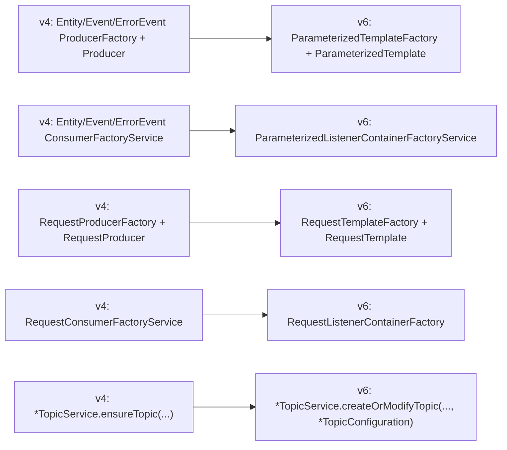

# Oppgradering: `v4` -> `v6`

> Eksakte tagger for dette hoppet: `v4.0.3 -> v6.0.0`.

Dette hoppet er et større API-skifte og bør behandles som en egen migrering.

## 1. Hurtigoversikt

| Område | Endring |
|---|---|
| Dependency/package | `no.fintlabs` -> `no.novari` |
| Plattform | Java 17 -> 21, Boot-bom i biblioteket til 3.5.x |
| Konfigurasjon | `fint.kafka.*` flyttes i stor grad til `novari.kafka.*` |
| Producer/consumer API | Spesialiserte factories -> parameteriserte templates/factories |
| Topic API | `ensureTopic(...)` -> `createOrModifyTopic(..., TopicConfiguration)` |
| Request/reply | `RequestProducer*` -> `RequestTemplate*`, endret retur- og record-modell |

## 2. Dependency, package og runtime

### 2.1 Maven-koordinat og package

- Fra: `no.fintlabs` (group/package)
- Til: `no.novari` (group/package)

```kotlin
// gammel
implementation("no.fintlabs:<artifact>:4.x")

// ny
implementation("no.novari:kafka:6.x")
```

### 2.2 Plattformkrav

- Java: `17` -> `21`
- Spring Boot BOM i biblioteket: `2.7.18` -> `3.5.7`
- Jakarta namespace brukes i v6 (`jakarta.annotation`)

## 3. Konfigurasjonsvariabler

| `v4` | `v6` | Kommentar |
|---|---|---|
| `fint.kafka.application-id` | `novari.kafka.application-id` | Brukes av origin-header |
| `fint.kafka.default-replicas` | `novari.kafka.default-replicas` | Beholdt, nytt prefix |
| `fint.kafka.topic.org-id` | `novari.kafka.topic.org-id` | Beholdt, nytt prefix |
| `fint.kafka.topic.domain-context` | `novari.kafka.topic.domain-context` | Beholdt, nytt prefix |
| `fint.kafka.enable-ssl` | `fint.kafka.enable-ssl` | Uendret nøkkel i `v6` |
| `fint.kafka.default-retention-time-ms` | fjernet | Erstattes av eksplisitt topic-konfig |
| `fint.kafka.default-partitions` | fjernet | Settes i topic-konfig |
| `fint.kafka.default-cleanup-policy` | fjernet | Settes i topic-konfig |

Eksempel `application.yml` i v6:

```yaml
spring:
  kafka:
    bootstrap-servers: localhost:9092
    consumer:
      group-id: my-consumer-group

novari:
  kafka:
    application-id: my-app
    default-replicas: 1
    topic:
      org-id: my-org
      domain-context: my-domain

fint:
  kafka:
    enable-ssl: false
```

## 4. API-mapping (klasse/service)



## 5. Kodeeksempler (gammel -> ny)

### 5.1 Producer: spesialisert -> parameterisert

`v4`:

```java
EventProducer<MyEvent> producer = eventProducerFactory.createProducer(MyEvent.class);
producer.send(
        EventProducerRecord.<MyEvent>builder()
                .topicNameParameters(
                        EventTopicNameParameters.builder()
                                .orgId("my-org")
                                .domainContext("my-domain")
                                .eventName("adapter-health")
                                .build()
                )
                .key("k1")
                .value(event)
                .build()
);
```

`v6`:

```java
ParameterizedTemplate<MyEvent> template = parameterizedTemplateFactory.createTemplate(MyEvent.class);
template.send(
        ParameterizedProducerRecord.<MyEvent>builder()
                .topicNameParameters(
                        EventTopicNameParameters.builder()
                                .topicNamePrefixParameters(
                                        TopicNamePrefixParameters
                                                .stepBuilder()
                                                .orgId("my-org")
                                                .domainContext("my-domain")
                                                .build()
                                )
                                .eventName("adapter-health")
                                .build()
                )
                .key("k1")
                .value(event)
                .build()
);
```

### 5.2 Consumer: pattern-spesifikk factory -> parameterisert factory

`v4`:

```java
ListenerContainerFactory<MyEvent, EventTopicNameParameters, EventTopicNamePatternParameters> factory =
        eventConsumerFactoryService.createRecordConsumerFactory(
                MyEvent.class,
                record -> handle(record.value()),
                EventConsumerConfiguration.builder()
                        .maxPollIntervalMs(15000)
                        .maxPollRecords(500)
                        .build()
        );
```

`v6`:

```java
ParameterizedListenerContainerFactory<MyEvent> factory =
        parameterizedListenerContainerFactoryService.createRecordListenerContainerFactory(
                MyEvent.class,
                record -> handle(record.value()),
                ListenerConfiguration
                        .stepBuilder()
                        .groupIdApplicationDefault()
                        .maxPollRecords(500)
                        .maxPollInterval(Duration.ofSeconds(15))
                        .continueFromPreviousOffsetOnAssignment()
                        .build(),
                errorHandlerFactory.createErrorHandler(
                        ErrorHandlerConfiguration.<MyEvent>stepBuilder()
                                .noRetries()
                                .skipFailedRecords()
                                .build()
                )
        );
```

### 5.3 Request/reply

`v4`:

```java
RequestProducer<String, ReplyPayload> requestProducer =
        requestProducerFactory.createProducer(
                ReplyTopicNameParameters.builder()
                        .applicationId("my-app")
                        .resource("sak")
                        .build(),
                String.class,
                ReplyPayload.class
        );

Optional<ConsumerRecord<String, ReplyPayload>> reply =
        requestProducer.requestAndReceive(
                RequestProducerRecord.<String>builder()
                        .topicNameParameters(
                                RequestTopicNameParameters.builder()
                                        .resource("sak")
                                        .parameterName("id")
                                        .build()
                        )
                        .value("request")
                        .build()
        );
```

`v6`:

```java
RequestTemplate<String, ReplyPayload> requestTemplate =
        requestTemplateFactory.createTemplate(
                ReplyTopicNameParameters.builder()
                        .topicNamePrefixParameters(
                                TopicNamePrefixParameters
                                        .stepBuilder()
                                        .orgId("my-org")
                                        .domainContext("my-domain")
                                        .build()
                        )
                        .applicationId("my-app")
                        .resourceName("sak")
                        .build(),
                String.class,
                ReplyPayload.class,
                Duration.ofSeconds(30),
                ListenerConfiguration.stepBuilder()
                        .groupIdApplicationDefault()
                        .maxPollRecordsKafkaDefault()
                        .maxPollIntervalKafkaDefault()
                        .continueFromPreviousOffsetOnAssignment()
                        .build()
        );

ConsumerRecord<String, ReplyPayload> reply =
        requestTemplate.requestAndReceive(
                new RequestProducerRecord<>(
                        RequestTopicNameParameters.builder()
                                .topicNamePrefixParameters(
                                        TopicNamePrefixParameters
                                                .stepBuilder()
                                                .orgId("my-org")
                                                .domainContext("my-domain")
                                                .build()
                                )
                                .resourceName("sak")
                                .parameterName("id")
                                .build(),
                        "request-key",
                        "request"
                )
        );
```

Viktige endringer i request/reply:

- `RequestProducerFactory`/`RequestProducer` er erstattet av `RequestTemplateFactory`/`RequestTemplate`.
- `requestAndReceive(...)` returnerer ikke lenger `Optional`, men `ConsumerRecord` og kaster exception ved feil.
- `RequestProducerRecord` har nå `key`.

### 5.4 Topic-oppretting: `ensureTopic` -> `createOrModifyTopic`

`v4`:

```java
eventTopicService.ensureTopic(
        EventTopicNameParameters.builder().eventName("adapter-health").build(),
        86_400_000L
);
```

`v6`:

```java
eventTopicService.createOrModifyTopic(
        EventTopicNameParameters.builder()
                .topicNamePrefixParameters(
                        TopicNamePrefixParameters
                                .stepBuilder()
                                .orgId("my-org")
                                .domainContext("my-domain")
                                .build()
                )
                .eventName("adapter-health")
                .build(),
        EventTopicConfiguration.stepBuilder()
                .partitions(1)
                .retentionTime(Duration.ofDays(1))
                .cleanupFrequency(EventCleanupFrequency.NORMAL)
                .build()
);
```

## 6. Endret oppførsel

### 6.1 Topic-parametre og validering

- `orgId`/`domainContext` flyttes inn i `TopicNamePrefixParameters`.
- `resource` blir `resourceName`.
- `RequestTopicNameParameters.isCollection` er fjernet.
- `RequestTopicNamePatternParameters` og `ReplyTopicNamePatternParameters` finnes ikke i v6.
- Topic-komponenter autoformatteres ikke lenger på samme måte som før; `.`/uppercase kan gi `IllegalArgumentException`.

### 6.2 Container-livssyklus

`ListenerBeanRegistrationService` er fjernet. Container-livssyklus må håndteres i applikasjonen (f.eks. `@Bean` eller eksplisitt `start()/stop()`).

### 6.3 AckMode-flyt

`ackMode` er ikke lenger felt i `ListenerConfiguration`. Settes ved behov via container-customizer:

```java
parameterizedListenerContainerFactoryService.createRecordListenerContainerFactory(
        MyEvent.class,
        record -> handle(record.value()),
        listenerConfiguration,
        errorHandler,
        container -> container.getContainerProperties().setAckMode(ContainerProperties.AckMode.BATCH)
);
```

### 6.4 Modell- og hjelpe-API-er

- `Error`/`ErrorCollection` fra `no.fintlabs.kafka.event.error` finnes ikke i v6.
- `getTopic(...)`/`getTopicConfig(...)` på topic-services finnes ikke i v6.
- `EventProducer.send(...)`/`EntityProducer.send(...)` (v4) returnerte `ListenableFuture`; `ParameterizedTemplate.send(...)` (v6) returnerer `CompletableFuture`.

### 6.5 Component scanning

Hvis applikasjonen scanner `no.fintlabs...` eksplisitt, må scanning utvides med `no.novari.kafka...`.

```java
@SpringBootApplication(scanBasePackages = {"no.fintlabs", "no.novari.kafka"})
public class Application {}
```

## 7. Sjekkliste

1. Oppdater dependency til `no.novari:kafka:6.x`.
2. Oppgrader applikasjon til Java 21 + Boot 3.x.
3. Bytt imports fra `no.fintlabs.kafka...` til `no.novari.kafka...`.
4. Migrer konfig fra `fint.kafka.*` til `novari.kafka.*` (unntak: `fint.kafka.enable-ssl`).
5. Erstatt spesialiserte producer/consumer-factories med parameteriserte factories/templates.
6. Migrer topic-navnobjekter til `TopicNamePrefixParameters`-mønsteret.
7. Migrer topic-oppretting til `createOrModifyTopic(..., *TopicConfiguration)`.
8. Håndter request/reply-endringer (`RequestTemplate`, ikke-Optional svar, key-støtte).
9. Verifiser container-livssyklus der dere tidligere brukte `ListenerBeanRegistrationService`.
